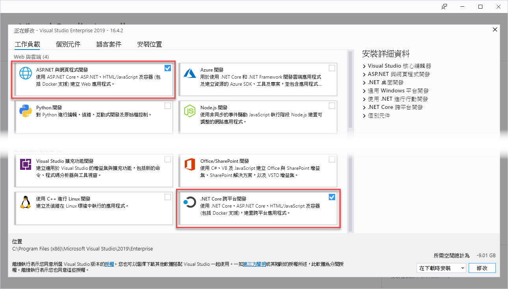
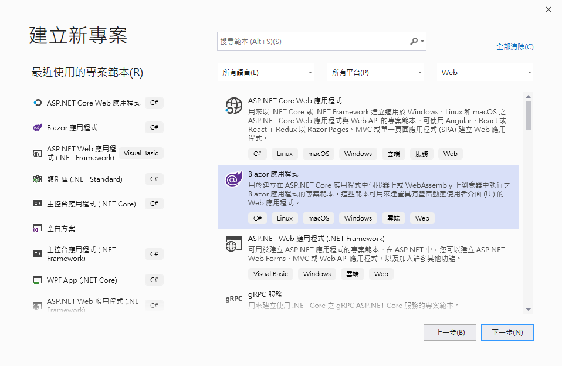
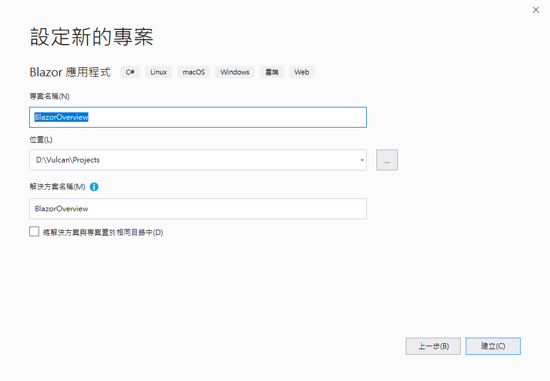
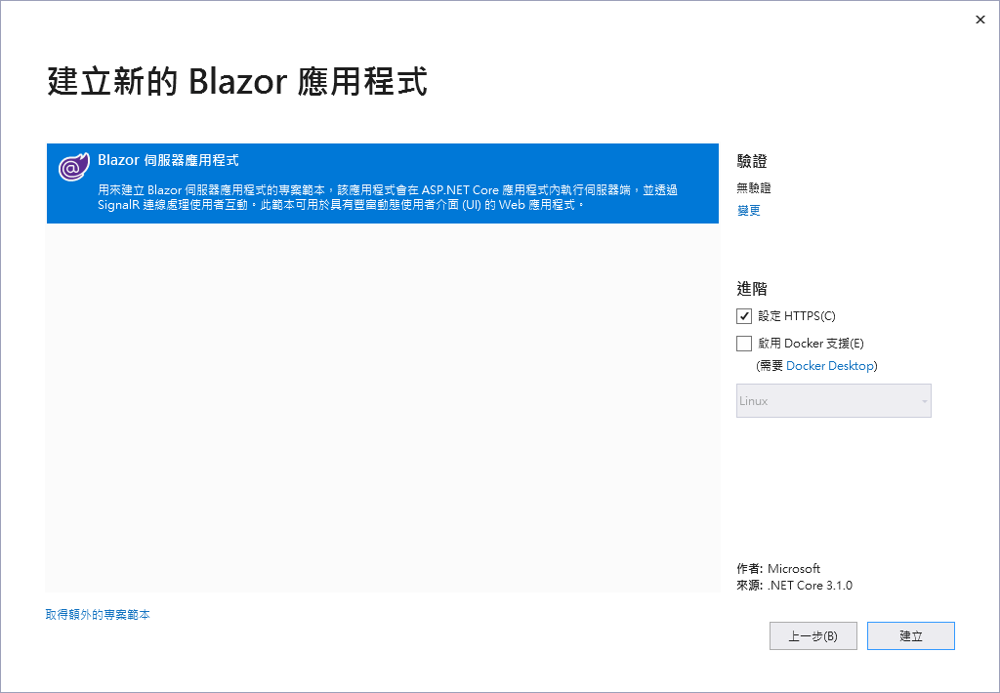
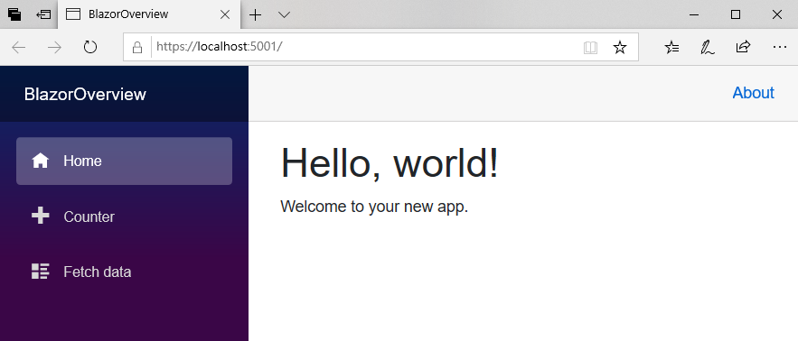

# 建立 Blazor Server Side 伺服器端的專案

首先，先要來學習如何透過 Visual Studio 2019 開發工具來建立一個 Blazor 伺服器端的專案

> 這本書的所有內容將會是在 Windows 10 專業版 (版本 1909 / 組建 18363.535) 與 Visual Studio 2019 Enterprise ( Version 16.4.2) 下所建立出來的，當然，任何 Visual Studio 2019 的版本皆可，不一定要使用 Enterprise 版本，Community / Professioal 版本也可以。
>
> 在安裝的時候，記得在 [工作負載] 頁次中，勾選 [ASP.NET 與網頁程式開發] 和 [.NET Core 跨平台開發]
  
  

- 打開 Visual Studio 2019 開發工具
- 當 [Visual Studio 2019] 對話窗出現之後，點選右下方的 [建立新的專案] 按鈕
  
  

- 在 [建立新專案] 對話窗內，請找出 [Blazor 應用程式] 這個專案開發範本，並且點選這個專案開發範本
- 請點選右下角 [下一步] 按鈕
  
  

- 出現 [設定新的專案] 對話窗，輸入適當的 [專案名稱] 、 [位置] ，完成後，請點選右下角 [建立] 按鈕
  
  

  I> ## 說明
  I>
  I> 在這個範例程式碼中，將會建立一個 BlazorOverview 專案名稱
  I> 
  
- 接下來將會看到 [建立新的 Blazor 應用程式] 對話窗，這裡可以根據當時開發專案需要，自行決定是否有調整 Blazor 專案的其他特性，不過，在這裡將不需要做任何額外的設定，請點選右下角的 [建立] 按鈕
  
  

  I> ## 注意事項
  I>
  I> 在建立練習專案的時候，無須在 [建立新的 Blazor 應用程式] 對話窗下，點選該對話窗右上方的 [驗證] 設定選項，也就是，維持 [驗證] 選項為 [無驗證]
  I> 
  
- 現在，這個 Blazor 專案已經建立完成

- 完成後的 Blazor 專案，將會有底下的方案結構

  

## 執行這個專案

- 請點選工具列上方的綠色三角形，或者按下 F5 ，開始執行這個 Blazor 專案
- 此時，將會在瀏覽器上出現底下畫面
  
  

## 結論

現在已經完成建立一個 Blazor 開發用的專案了
