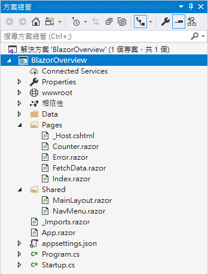

# 建立 Blazor 伺服器端的專案

首先，先要來學習如何透過 Visual Studio 2019 開發工具來建立一個 Blazor 伺服器端的專案

- 打開 Visual Studio 2019 開發工具
- 當 [Visual Studio 2019] 對話窗出現之後，點選右下方的 [建立新的專案] 按鈕
  
  

- 在 [建立新專案] 對話窗內，請找出 [Blazor 應用程式] 這個專案開發範本，並且點選這個專案開發範本
- 請點選右下角 [下一步] 按鈕
  
  

- 出現 [設定新的專案] 對話窗，輸入適當的 [專案名稱] 、 [位置] ，完成後，請點選右下角 [建立] 按鈕
  
  

  I> ## 說明
  I>
  I> 在這個範例程式碼中，將會建立一個 BlazorOverview 專案名稱
  I> 
  
- 此時將會看到 [建立新的 Blazor 應用程式] 對話窗，這裡可以根據當時開發專案的需要，自行決定是否有調整 Blazor 專案的其他特性，若無，請點選右下角的 [建立] 按鈕

  I> ## 注意事項
  I>
  I> 在建立練習專案的時候，無須在 [建立新的 Blazor 應用程式] 對話窗下，點選該對話窗右上方的 [驗證] 設定選項，也就是，維持 [驗證] 選項為 [無驗證]
  I> 
  
- 此時，這個 Blazor 專案已經建立完成
  
  

- 完成後的 Blazor 專案，將會有底下的方案結構

  

## 執行這個專案

- 請點選工具列上方的綠色三角形，或者按下 F5 ，開始執行這個 Blazor 專案
- 此時，將會在瀏覽器上出現底下畫面
  
  

## 結論

現在已經完成建立一個 Blazor 開發用的專案了
