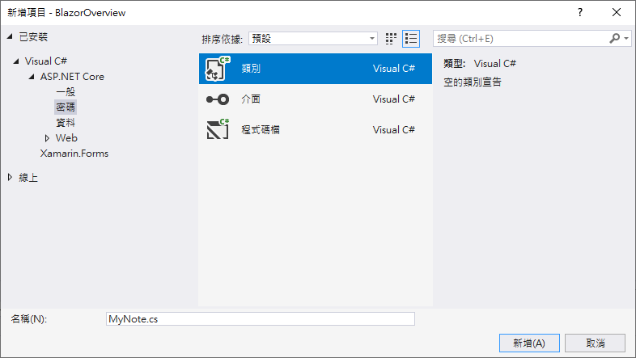
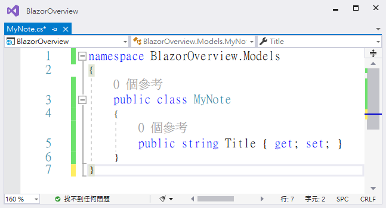
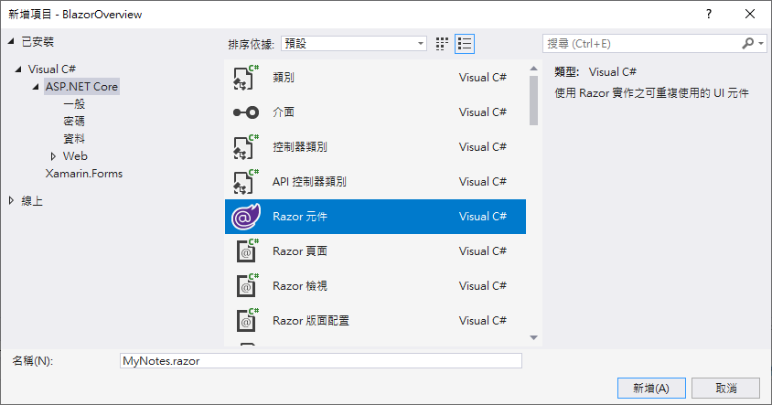
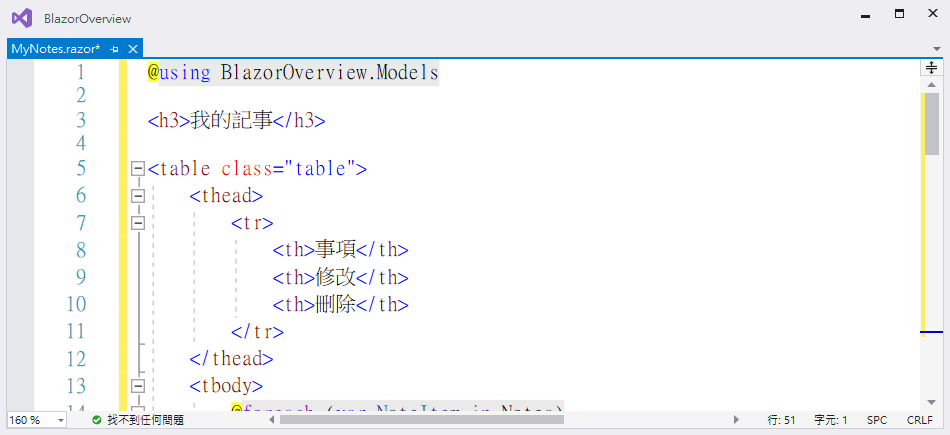
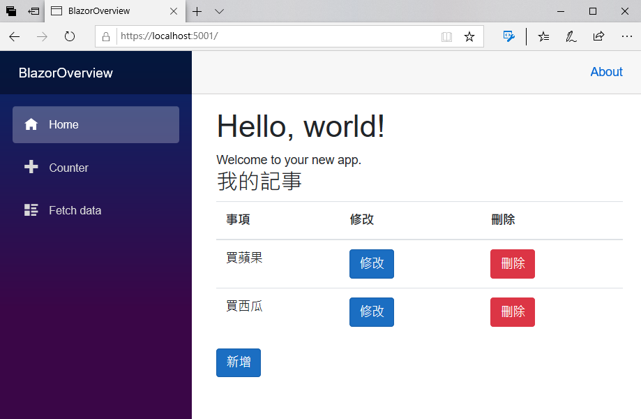
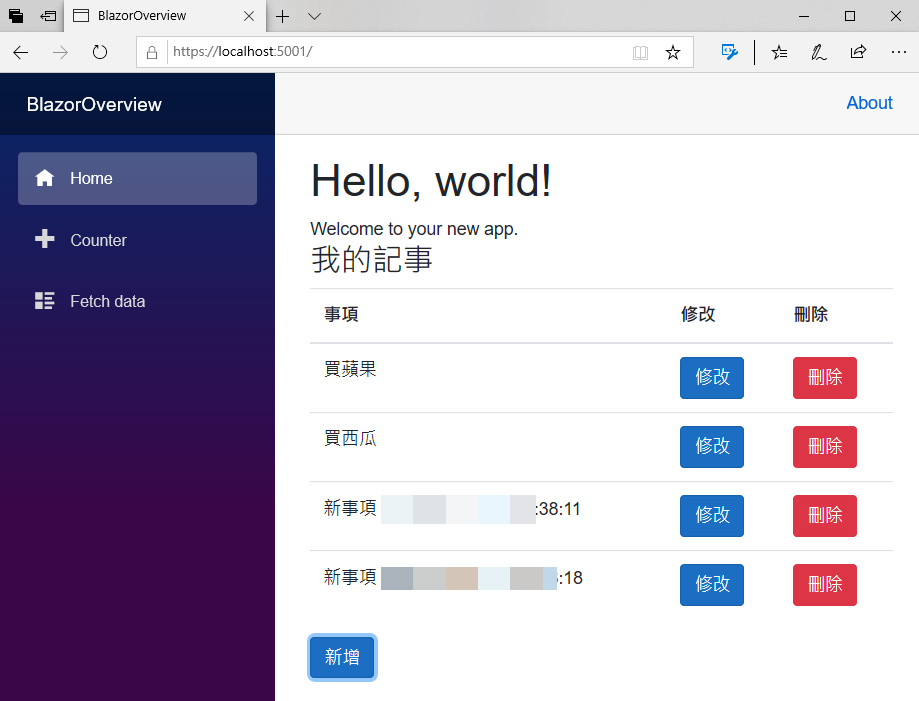
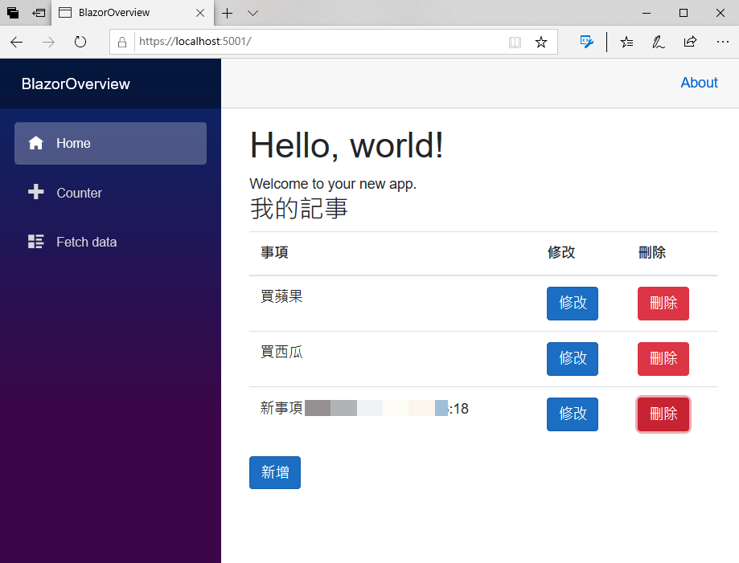

# 開始設計CRUD 的新增與刪除功能

現在要來先建立一個 Blazor 專案的 CRUD之新增與修改功能

## 建立專案會用到的資料模型

- 滑鼠右擊專案節點
- 在彈出功能表點選 [加入] > [新增資料夾]
- 使用 `Models` 作為該新資料夾的名稱
- 滑鼠右擊 [Models] 資料夾節點
- 在彈出功能表點選 [加入] > [類別]
- 出現 [新增項目 - BlazorOverview] 對話窗
- 請在 [名稱] 欄位，輸入 `MyNote.cs`
- 最後，請點選 [新增] 按鈕
 
  

- 使用底下程式碼來替換到這個檔案內的所有內容
 
  

```csharp
namespace BlazorOverview.Models
{
    public class MyNote
    {
        public string Title { get; set; }
    }
}
```

## 建立與設計 Blazor 元件

- 滑鼠右擊 [Pages] 資料夾節點
- 在彈出功能表點選 [加入] > [新增項目]
- 出現 [新增項目 - BlazorOverview] 對話窗
- 請確認該對話窗左方的清單位於 [已安裝] > [Visual C#] > [ASP.NET Core] 節點上
- 在該對話窗的中間區域，點選 [Blazor 元件] 這個選項
- 請在 [名稱] 欄位，輸入 `MyNotes.razor`
- 最後，請點選 [新增] 按鈕
  
  

 - 使用底下 Razor 程式碼來替換到這個檔案內的所有內容
 
  

```html
@using BlazorOverview.Models

<h3>我的記事</h3>

@*這裡是 HTML 的標記宣告*@
<table class="table">
    <thead>
        <tr>
            <th>事項</th>
            <th>修改</th>
            <th>刪除</th>
        </tr>
    </thead>
    <tbody>
        @*列出集合清單中的每一筆紀錄到 HTML Table 內*@
        @foreach (var NoteItem in Notes)
        {
            <tr>
                @*透過資料綁定，把集合清單內的紀錄屬性，顯示在網頁上*@
                <td>@NoteItem.Title</td>
                @*這個按鈕尚未進行任何設計*@
                <td><input type="button" class="btn btn-primary" value="修改" /></td>
                <td>
                    @*透過 Blazor 的資料綁定，將刪除按鈕的點選事件，綁定到 C# 的委派處理方法*@
                    <input type="button" class="btn btn-danger" value="刪除"
                           @onclick="()=>Delete(NoteItem)" />
                </td>
            </tr>
        }
    </tbody>
</table>
<div>
    @*透過 Blazor 的資料綁定，將新增按鈕的點選事件，綁定到 C# 的委派處理方法*@
    <input type="button" class="btn btn-primary" @onclick="Add" value="新增" />
</div>

@code {
    // 儲存要顯示的集合清單內的所有紀錄
    public List<MyNote> Notes { get; set; } = new List<MyNote>();

    // 元件建立的時候，所要執行的初始化工作
    protected override void OnInitialized()
    {
        // 預設建立的集合清單紀錄
        Notes = new List<MyNote>()
        {
            new MyNote { Title= "買蘋果" },
            new MyNote { Title="買西瓜" }
        };
    }
    // 新增按鈕的點選事件之處理委派方法
    private void Add()
    {
        //加入一筆紀錄到集合清單內
        Notes.Add(new MyNote { Title = $"新事項 {DateTime.Now.ToString()}" });
    }
    // 刪除按鈕的點選事件之處理委派方法
    private void Delete(MyNote note)
    {
        //從集合清單中刪除所選擇的紀錄
        Notes.Remove(note);
    }
}
```

## 在 Blazor 專案首頁，加入此元件

- 在 [Pages] 資料夾中找到 [Index.razor] 這個檔案
- 打開這個檔案
- 使用底下 Razor 程式碼來替換到這個檔案內的所有內容

  T> ## 說明
  T>
  T> 在這裡僅加入 `<MyNotes />` 這個元件參考，讓這個剛剛設計的新 Blazor 元件，可以顯示在首頁上
  T> 

```html
@page "/"

<h1>Hello, world!</h1>

Welcome to your new app.

@*使用 HTML Tag 標籤宣告方式，宣告這裡要顯示 MyNotes 這個 Blazor 元件*@
<MyNotes />
```

## 執行這個專案

- 請點選工具列上方的綠色三角形，或者按下 F5 ，開始執行這個 Blazor 專案
- 此時，將會在瀏覽器上出現底下畫面
  
  

- 點選 [新增] 按鈕兩次
- 此時將會自動加入兩筆紀錄到集合清單內
- 這裡是透過 Blazor 內建的資料綁定 Data Binding 機制，將會顯示在瀏覽器網頁上，如下面螢幕截圖
  
  

- 點選到數第二筆紀錄的 紅色 [刪除] 按鈕
- 此時，該筆紀錄將會從集合清單內刪除掉，並且即時更新在網頁上，如下面螢幕截圖
  
  

## 結論

現在已經完成具有新增與刪除 Blazor 專案了，不過，所有的集合清單資料，都是儲存在記憶體內，一旦專案關閉結束並且重新執行，這些及合金單資料將會消失不見。
