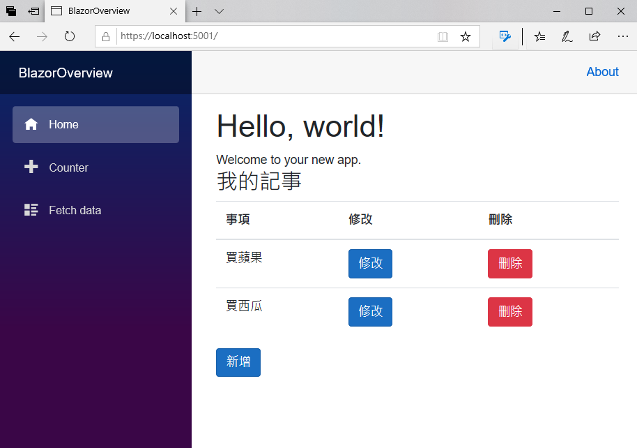
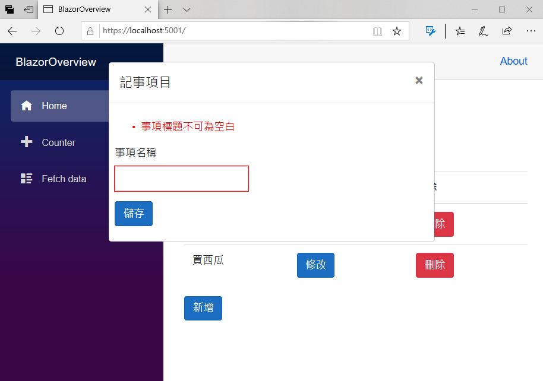
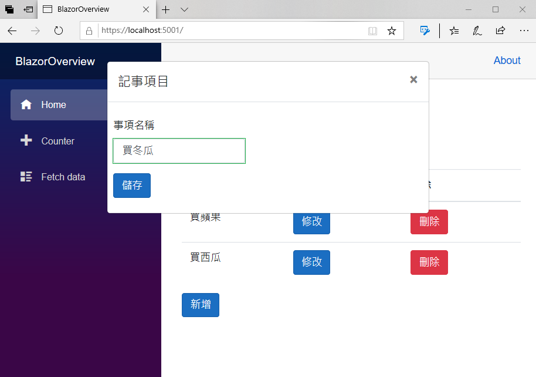
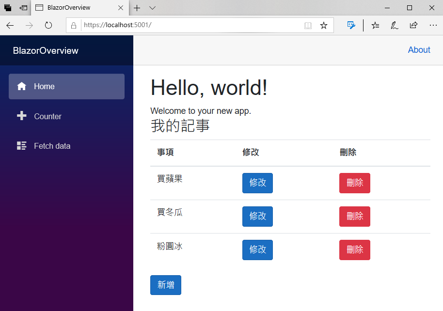

# 增加 CRUD 的新增與修改對話窗功能

這裡將要使用對話窗的機制來擴增該專案的新增與修改功能，不過，在這裡將不會使用到任何 JavaScript 與 jQuery 的機制，僅需要使用 C# & HTML 就可以完成這樣的設計

T> ## 提示說明
T>
T> 當在開發前端網頁的時候，若想要使用 Bootstrap Modal 對話窗功能，對於要顯示與隱藏對話窗的時間，需要透過 JavaScript 程式碼的使用與呼叫，而在 Blazor 專案內，可以充分利用 資料綁定 Data Binding 的機制，透過 C# 變數來控制那些 HTML 標記要顯示還是要隱藏起來。
T>

## 修正資料模型具有內建驗證屬性

- 在專案中，找到 [Models] 資料夾
- 打開該資料夾內的 [MyNote.cs] 檔案
- 找到 Title 屬性，在該屬性前面加上 `[Required(ErrorMessage = "事項標題不可為空白")]` 資料驗證的屬性宣告
- 在該檔案最前面，加入 `using System.ComponentModel.DataAnnotations;` 使用這個命名空間
- 另外，修正這個 MyNote 資料模型類別，要實作出 ICloneable 這個介面
- 使用明確實作方式，實作出 `object ICloneable.Clone()` 這個方法，該方法內將會使用 `return this.MemberwiseClone();` 敘述來回傳本身物件的淺層複製物件出來
- 增加一個強型別的 `Clone()` 方法，讓該方法回傳一個型別為 MyNote 的物件副本，該方法內將會使用 `` 敘述取得這個物件的淺層複製副本
- 底下是這個類別的完成修正結果程式碼

```csharp
using System;
using System.ComponentModel.DataAnnotations;

namespace BlazorOverview.Models
{
    public class MyNote :ICloneable
    {
        // 要加上這個屬性宣告，讓表單資料驗證可以檢查 Title 不可為空白
        [Required(ErrorMessage = "事項標題不可為空白")]
        public string Title { get; set; }
        // 使用淺層複製的方式，產生出相同屬性值的物件
        public MyNote Clone()
        {
            return ((ICloneable)this).Clone() as MyNote;
        }
        // 這裡為使用明確方式來實作 ICloneable 介面
        object ICloneable.Clone()
        {
           return this.MemberwiseClone();
        }
    }
}
```

## 修正 MyNotes 元件可以使用對話窗來新增與修改

- 在專案中，找到 [Pages] 資料夾
- 打開該資料夾內的 [MyNotes.razor] 檔案
- 在 HTML 標記中，找到 ` <td><input type="button" class="btn btn-primary" value="修改" /></td>` 標記的宣告，修改成為底下的標記宣告

```html
<td>
    @*透過 Blazor 的資料綁定，將修改按鈕的點選事件，綁定到 C# 的委派處理方法*@
    @*當該修改按鈕點選事件被觸發的時候，將會把現在顯示的紀錄物件傳送過去*@
    <input type="button" class="btn btn-primary" value="修改"
           @onclick="()=>Update(NoteItem)" />
</td>
```

- 找到 `@code {` 文字，在其前面加入底下的標記

```html
@*由 C# 的變數 ShowPopup 來控制，這裡的 HTML 標記是否要顯示出來，這裡完全不需要使用到 JavaScript 或者 jQuery*@
@if (ShowPopup)
{
    //這裡是 BootStrap 的標準對話窗標記宣告
    <div class="modal" tabindex="-1" role="dialog" style="display:block">
        <div class="modal-dialog" role="document">
            <div class="modal-content">
                <div class="modal-header">
                    <h5 class="modal-title">記事項目</h5>
                    @*這裡將會宣告一個按鈕，點選這個按鈕，將會關閉此對話窗*@
                    <button type="button" class="close" @onclick="CloseDialog">
                        <span aria-hidden="true">×</span>
                    </button>
                </div>
                <div class="modal-body">
                    <div class="row">
                        <div class="col-9">
                            <div class="row p-2">
                                @*使用 Blazor 提供的 EditForm 元件來進行表單資料輸入與驗證*@
                                @*其中 EditForm 提供有效資料驗證 OnValidSubmit的事件*@
                                <EditForm Model="@CurrentMyNote" OnValidSubmit="@HandleValidSubmit">
                                    @*DataAnnotationsValidator 元件會使用資料模型的屬性宣告，將驗證支援附加至 EditContext*@
                                    <DataAnnotationsValidator />
                                    @*ValidationSummary 元件會匯總所有驗證訊息*@
                                    <ValidationSummary />
                                    <div class="form-group">
                                        <label for="taskName">事項名稱</label>
                                        @*這裡提供使用者輸入該事項的名稱，並會儲存到 Title 屬性內*@
                                        <InputText id="name" class="form-control" @bind-Value="@CurrentMyNote.Title" />
                                    </div>
                                    @*宣告 儲存  按鈕，點選後，若資料沒有錯誤，將會觸發 OnValidSubmit 所綁定的事件委派方法*@
                                    <button type="submit" class="btn btn-primary">儲存</button>
                                </EditForm>
                            </div>
                        </div>
                    </div>
                </div>
            </div>
        </div>
    </div>
}
```

  T> ## 提示說明
  T>
  T> 這裡的 C# ShowPopup 變數，就是用來控制對話窗是否要顯示的控制項目
   
- 在 `@code{` 文字下方，找到 `private void Add()` 方法，將其方法刪除掉
- 在 `@code {` 文字下方，加入底下的屬性或者欄位宣告

```csharp
// 正在編輯或者新增的紀錄物件
public MyNote CurrentMyNote { get; set; } = new MyNote();
// 記錄下修改前的紀錄物件
public MyNote OrigMyNote { get; set; } = new MyNote();
// 是否要顯示新增或修改對話窗
public bool ShowPopup { get; set; } = false;
// 這次處理的紀錄是否為新增，若該屬性為 false，則表示這次要修改紀錄
public bool IsNewMode { get; set; }
```

- 在 `@code {}` 程式碼區塊之後，加入底下的方法定義

```csharp
// 新增按鈕的點選事件之處理委派方法
private void Add()
{
    // 設定此次要進行新增一筆紀錄
    IsNewMode = true;
    //產生要新增的紀錄物件
    CurrentMyNote = new MyNote();
    // 顯示新增紀錄使用的對話窗
    ShowPopup = true;
}
// 修改按鈕的點選事件之處理委派方法
private void Update(MyNote note)
{
    // 設定此次要進行修改紀錄
    IsNewMode = false;
    CurrentMyNote = OrigMyNote = note.Clone();
    //產生一個物件副本，做為要修改的紀錄物件
    CurrentMyNote = note.Clone();
    //保存此次要修改的紀錄物件
    OrigMyNote = note;
    // 顯示新增紀錄使用的對話窗
    ShowPopup = true;
}
// 關閉對話窗的方法
private void CloseDialog()
{
    // 設定要關閉對話窗的變數，讓對話窗的 HTML 標記不會顯示在瀏覽器畫面上
    ShowPopup = false;
}
// 當使用者連完資料資料且點選 儲存 按鈕之後，若沒有錯誤產生，就會觸發此委派方法
private void HandleValidSubmit()
{
    // 設定要關閉對話窗的變數，讓對話窗的 HTML 標記不會顯示在瀏覽器畫面上
    ShowPopup = false;
    //判斷此次動作是要新增還是要修改紀錄
    if (IsNewMode == true)
    {
        //加入一筆紀錄到集合清單內
        Notes.Add(CurrentMyNote);
    }
    else
    {
        // 修改該紀錄
        OrigMyNote.Title = CurrentMyNote.Title;
    }
}
```
## 設計完成後的完整 MyNotes.razor 內容

- 確認這個 MyNotes.razor 檔案內容，與底下的標記和程式碼相同

```html
@using BlazorOverview.Models

<h3>我的記事</h3>

@*這裡是 HTML 的標記宣告*@
<table class="table">
    <thead>
        <tr>
            <th>事項</th>
            <th>修改</th>
            <th>刪除</th>
        </tr>
    </thead>
    <tbody>
        @*列出集合清單中的每一筆紀錄到 HTML Table 內*@
        @foreach (var NoteItem in Notes)
        {
        <tr>
            @*透過資料綁定，把集合清單內的紀錄屬性，顯示在網頁上*@
            <td>@NoteItem.Title</td>
            <td>
                @*透過 Blazor 的資料綁定，將修改按鈕的點選事件，綁定到 C# 的委派處理方法*@
                @*當該修改按鈕點選事件被觸發的時候，將會把現在顯示的紀錄物件傳送過去*@
                <input type="button" class="btn btn-primary" value="修改"
                       @onclick="()=>Update(NoteItem)" />
            </td>
            <td>
                @*透過 Blazor 的資料綁定，將刪除按鈕的點選事件，綁定到 C# 的委派處理方法*@
                <input type="button" class="btn btn-danger" value="刪除"
                       @onclick="()=>Delete(NoteItem)" />
            </td>
        </tr>
        }
    </tbody>
</table>
<div>
    @*透過 Blazor 的資料綁定，將新增按鈕的點選事件，綁定到 C# 的委派處理方法*@
    <input type="button" class="btn btn-primary" @onclick="Add" value="新增" />
</div>

@*由 C# 的變數 ShowPopup 來控制，這裡的 HTML 標記是否要顯示出來，這裡完全不需要使用到 JavaScript 或者 jQuery*@
@if (ShowPopup)
{
    //這裡是 BootStrap 的標準對話窗標記宣告
    <div class="modal" tabindex="-1" role="dialog" style="display:block">
        <div class="modal-dialog" role="document">
            <div class="modal-content">
                <div class="modal-header">
                    <h5 class="modal-title">記事項目</h5>
                    @*這裡將會宣告一個按鈕，點選這個按鈕，將會關閉此對話窗*@
                    <button type="button" class="close" @onclick="CloseDialog">
                        <span aria-hidden="true">×</span>
                    </button>
                </div>
                <div class="modal-body">
                    <div class="row">
                        <div class="col-9">
                            <div class="row p-2">
                                @*使用 Blazor 提供的 EditForm 元件來進行表單資料輸入與驗證*@
                                @*其中 EditForm 提供有效資料驗證 OnValidSubmit的事件*@
                                <EditForm Model="@CurrentMyNote" OnValidSubmit="@HandleValidSubmit">
                                    @*DataAnnotationsValidator 元件會使用資料模型的屬性宣告，將驗證支援附加至 EditContext*@
                                    <DataAnnotationsValidator />
                                    @*ValidationSummary 元件會匯總所有驗證訊息*@
                                    <ValidationSummary />
                                    <div class="form-group">
                                        <label for="taskName">事項名稱</label>
                                        @*這裡提供使用者輸入該事項的名稱，並會儲存到 Title 屬性內*@
                                        <InputText id="name" class="form-control" @bind-Value="@CurrentMyNote.Title" />
                                    </div>
                                    @*宣告 儲存  按鈕，點選後，若資料沒有錯誤，將會觸發 OnValidSubmit 所綁定的事件委派方法*@
                                    <button type="submit" class="btn btn-primary">儲存</button>
                                </EditForm>
                            </div>
                        </div>
                    </div>
                </div>
            </div>
        </div>
    </div>
}

@code {
    // 儲存要顯示的集合清單內的所有紀錄
    public List<MyNote> Notes { get; set; } = new List<MyNote>();

    // 正在編輯或者新增的紀錄物件
    public MyNote CurrentMyNote { get; set; } = new MyNote();
    // 記錄下修改前的紀錄物件
    public MyNote OrigMyNote { get; set; } = new MyNote();
    // 是否要顯示新增或修改對話窗
    public bool ShowPopup { get; set; } = false;
    // 這次處理的紀錄是否為新增，若該屬性為 false，則表示這次要修改紀錄
    public bool IsNewMode { get; set; }

    // 元件建立的時候，所要執行的初始化工作
    protected override void OnInitialized()
    {
        // 預設建立的集合清單紀錄
        Notes = new List<MyNote>()
        {
            new MyNote { Title= "買蘋果" },
            new MyNote { Title="買西瓜" }
        };
    }
    // 刪除按鈕的點選事件之處理委派方法
    private void Delete(MyNote note)
    {
        //從集合清單中刪除所選擇的紀錄
        Notes.Remove(note);
    }

    // 新增按鈕的點選事件之處理委派方法
    private void Add()
    {
        // 設定此次要進行新增一筆紀錄
        IsNewMode = true;
        //產生要新增的紀錄物件
        CurrentMyNote = new MyNote();
        // 顯示新增紀錄使用的對話窗
        ShowPopup = true;
    }
    // 修改按鈕的點選事件之處理委派方法
    private void Update(MyNote note)
    {
        // 設定此次要進行修改紀錄
        IsNewMode = false;
        CurrentMyNote = OrigMyNote = note.Clone();
        //產生一個物件副本，做為要修改的紀錄物件
        CurrentMyNote = note.Clone();
        //保存此次要修改的紀錄物件
        OrigMyNote = note;
        // 顯示新增紀錄使用的對話窗
        ShowPopup = true;
    }
    // 關閉對話窗的方法
    private void CloseDialog()
    {
        // 設定要關閉對話窗的變數，讓對話窗的 HTML 標記不會顯示在瀏覽器畫面上
        ShowPopup = false;
    }
    // 當使用者連完資料資料且點選 儲存 按鈕之後，若沒有錯誤產生，就會觸發此委派方法
    private void HandleValidSubmit()
    {
        // 設定要關閉對話窗的變數，讓對話窗的 HTML 標記不會顯示在瀏覽器畫面上
        ShowPopup = false;
        //判斷此次動作是要新增還是要修改紀錄
        if (IsNewMode == true)
        {
            //加入一筆紀錄到集合清單內
            Notes.Add(CurrentMyNote);
        }
        else
        {
            // 修改該紀錄
            OrigMyNote.Title = CurrentMyNote.Title;
        }
    }
}
```

## 執行這個專案

- 請點選工具列上方的綠色三角形，或者按下 F5 ，開始執行這個 Blazor 專案
- 此時，將會在瀏覽器上出現底下畫面
  
  

- 請點選 [買西瓜] 文字旁的 [修改] 按鈕
- 現在將會要修改記事紀錄的彈出對話窗，出現如下面螢幕截圖畫面
  
  

- 請任意修改 [事項名稱] 欄位內的內容
- 點選該對話窗的右上方 X 按鈕，關閉這個對話窗，看看清單項目的內容有沒有被影響到
- 再度點選 [買西瓜] 文字旁的 [修改] 按鈕
- 在修改紀錄對話窗出現之後，請將 [事項名稱] 欄位的內容清空，此時，將會看到如下圖，有錯誤訊息出現在該 [事項名稱] 欄位前面
- 而且，這個時候，點選 [儲存] 按鈕，也無法關閉這個對話窗與儲存這次修改的動作；這是因為表單驗證的功能有發揮功用，自動檢查輸入資料是否有符合宣告
  
  

- 現在，請將 [事項名稱] 欄位的內容，修改成為 `買冬瓜`
- 注意該 [事項名稱] 欄位的四周出現綠色方框，表示這次輸入的資料符合系統所需要
  
  

- 完成後，請點選 [儲存] 按鈕
- 現在資料將會進行儲存，並且關閉該對話窗與回到集合清單瀏覽畫面
- 在清單瀏覽畫面中，將會看到原先 [買西瓜] 的記事事項，已經修改成為 [買冬瓜] 了
  
  

- 點選下方的 [新增] 按鈕
- 現在將會要新增記事紀錄的彈出對話窗
- 請在 [事項名稱] 欄位中，輸入 `粉圓冰` 文字，出現如下面螢幕截圖畫面
  
  

- 請點選 [儲存] 按鈕
- 現在資料將會進行新增，並且關閉該對話窗與回到集合清單瀏覽畫面下，所以，可以從網頁中看到剛剛新增完成的事項紀錄
  
  

## 結論

現在已經使用 Blazor 技術，完成了一個具有 CRUD 新增、查詢、更新、刪除的網頁，而且在進行新增與修改的時候，將會使用 BootStrap 提供的對話窗機制來顯示出來；不過，這些 CRUD 的動作將會分散在這個 Razor 元件的各個地方，這樣會造成日後程式碼維護起來會相當的麻煩；接下來將會把這些記事處理的程式碼彙整成為一個服務，並且使用 ASP.NET Core 內建的 DI / IoC 容器服務，註冊這個記事服務，而在剛剛設計的 Blazor 元件內，就可以注入這個記事服務來直接使用。
