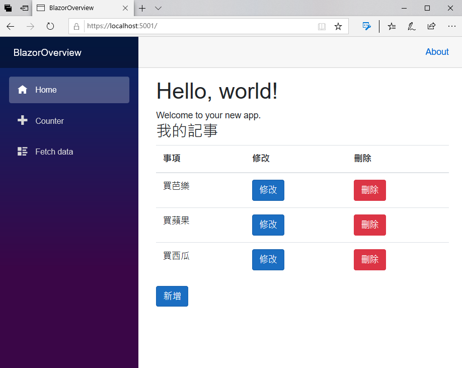
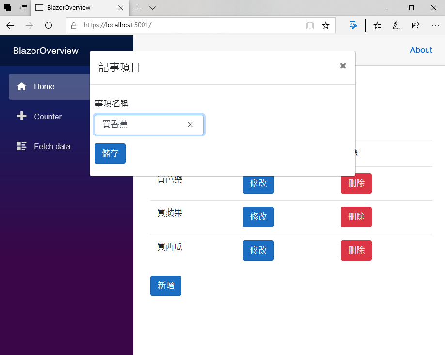
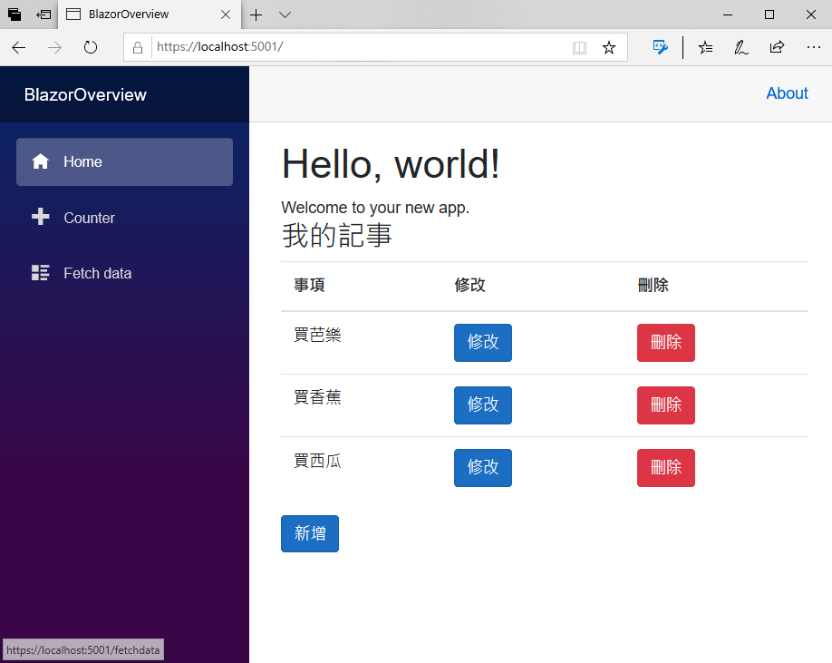
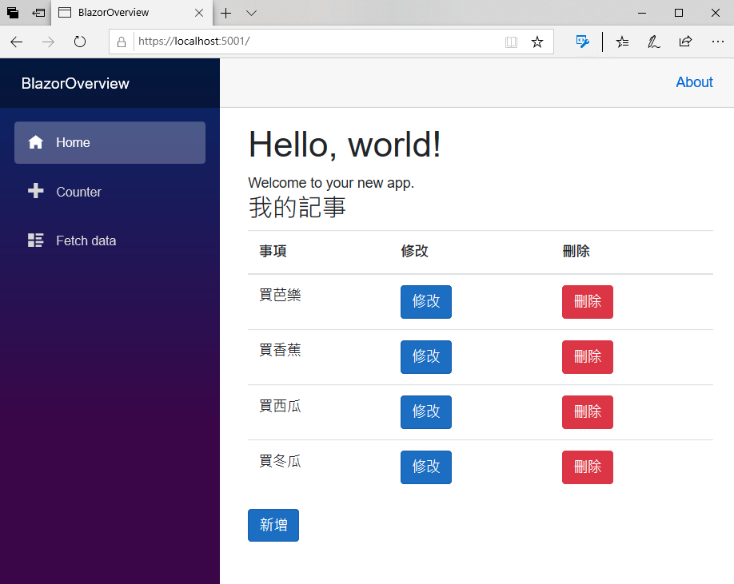
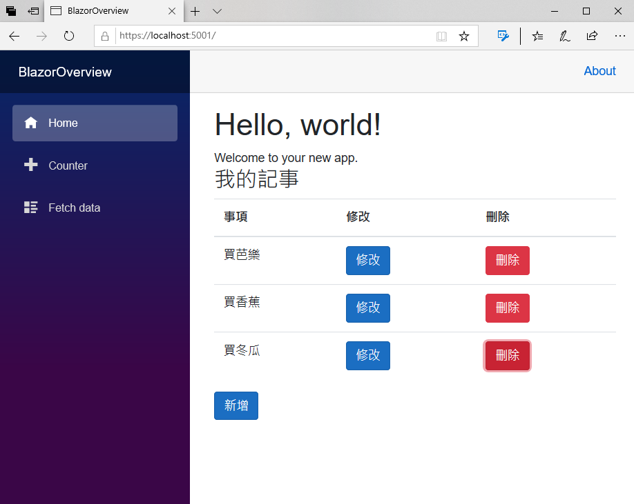

# 建立記事服務並且使用相依性注入服務

對於要能夠開發出好維護的專案，最好能夠不要把具體實作直接寫在各個 Razor 元件內，而是使用抽象型別來設計，而實際的實作程式碼，將會透過系統內建的相依性注入容器來注入到所需要的 Razor 元件內，接下來將說明如何做到這樣的專案設計。

## 建立記事的抽象型別與具體實作類別

- 滑鼠右擊專案節點
- 在彈出功能表點選 [加入] > [新增資料夾]
- 使用 `Services` 作為該新資料夾的名稱
- 滑鼠右擊 [Services] 資料夾節點
- 在彈出功能表點選 [加入] > [類別]
- 出現 [新增項目 - BlazorOverview] 對話窗
- 請在 [名稱] 欄位，輸入 `IMyNoteService.cs`
- 最後，請點選 [新增] 按鈕
- 使用底下程式碼來替換到這個檔案內的所有內容

```csharp
using BlazorOverview.Models;
using System.Collections.Generic;
using System.Threading.Tasks;

namespace BlazorOverview.Services
{
    public interface IMyNoteService
    {
        // 建立一筆新記事紀錄
        Task CreateAsync(MyNote myNote);
        // 刪除記事紀錄
        Task DeleteAsync(MyNote myNote);
        // 查詢所有記事紀錄
        Task<List<MyNote>> RetriveAsync();
        // 修改記事紀錄
        Task UpdateAsync(MyNote origMyNote, MyNote myNote);
    }
}
```

- 現在要來建立實作剛剛設計的抽象介面之具體實作類別
- 滑鼠右擊 [Services] 資料夾節點
- 在彈出功能表點選 [加入] > [類別]
- 出現 [新增項目 - BlazorOverview] 對話窗
- 請在 [名稱] 欄位，輸入 `MyNoteService.cs`
- 最後，請點選 [新增] 按鈕
- 使用底下程式碼來替換到這個檔案內的所有內容

```csharp
using BlazorOverview.Models;
using System.Collections.Generic;
using System.Linq;
using System.Threading.Tasks;

namespace BlazorOverview.Services
{
    public class MyNoteService : IMyNoteService
    {
        // 記事清單的私有欄位物件
        List<MyNote> MyNotes { get; set; }
        public MyNoteService()
        {
            // 預設建立的集合清單紀錄
            MyNotes = new List<MyNote>()
            {
                new MyNote { Title= "買芭樂" },
                new MyNote { Title= "買蘋果" },
                new MyNote { Title="買西瓜" }
            };
        }
        // 建立一筆新記事紀錄
        public Task CreateAsync(MyNote myNote)
        {
            MyNotes.Add(myNote);
            // 因為這裡都是使用同步呼叫，所以需要回傳一個工作物件
            return Task.FromResult(0);
        }
        // 查詢所有記事紀錄
        public Task<List<MyNote>> RetriveAsync()
        {
            // 因為這裡都是使用同步呼叫，所以需要回傳一個工作物件
            return Task.FromResult(MyNotes);
        }
        // 修改記事紀錄
        public Task UpdateAsync(MyNote origMyNote, MyNote myNote)
        {
            MyNotes.FirstOrDefault(x => x.Title == origMyNote.Title).Title = myNote.Title;
            // 因為這裡都是使用同步呼叫，所以需要回傳一個工作物件
            return Task.FromResult(0);
        }
        // 刪除記事紀錄
        public Task DeleteAsync(MyNote myNote)
        {
            MyNotes.Remove(MyNotes.FirstOrDefault(x => x.Title == myNote.Title));
            // 因為這裡都是使用同步呼叫，所以需要回傳一個工作物件
            return Task.FromResult(0);
        }
    }
}
```
## 將 MyNoteService 服務註冊到 DI Container 內

- 在專案中，找到 [Startup.cs] 資料夾
- 打開這個檔案
- 在 [Starup] 類別的最前面，加入底下的加入命名空間宣告程式碼

```csharp
using BlazorOverview.Services;
```

- 找到 `ConfigureServices` 
- 在這個方法的最後面，加入底下的程式碼

```csharp
// 進行 DI 容器註冊
services.AddScoped<IMyNoteService, MyNoteService>();
```

## 設計完成後的完整 Startup.cs 內容

- 確認這個 Startup.cs 檔案內容，與底下的程式碼相同

```csharp
using System;
using System.Collections.Generic;
using System.Linq;
using System.Threading.Tasks;
using Microsoft.AspNetCore.Builder;
using Microsoft.AspNetCore.Components;
using Microsoft.AspNetCore.Hosting;
using Microsoft.AspNetCore.HttpsPolicy;
using Microsoft.Extensions.Configuration;
using Microsoft.Extensions.DependencyInjection;
using Microsoft.Extensions.Hosting;
using BlazorOverview.Data;
using BlazorOverview.Services;

namespace BlazorOverview
{
    public class Startup
    {
        public Startup(IConfiguration configuration)
        {
            Configuration = configuration;
        }

        public IConfiguration Configuration { get; }

        // This method gets called by the runtime. Use this method to add services to the container.
        // For more information on how to configure your application, visit https://go.microsoft.com/fwlink/?LinkID=398940
        public void ConfigureServices(IServiceCollection services)
        {
            services.AddRazorPages();
            services.AddServerSideBlazor();
            services.AddSingleton<WeatherForecastService>();

            // 進行 DI 容器註冊
            services.AddScoped<IMyNoteService, MyNoteService>();
        }

        // This method gets called by the runtime. Use this method to configure the HTTP request pipeline.
        public void Configure(IApplicationBuilder app, IWebHostEnvironment env)
        {
            if (env.IsDevelopment())
            {
                app.UseDeveloperExceptionPage();
            }
            else
            {
                app.UseExceptionHandler("/Error");
                // The default HSTS value is 30 days. You may want to change this for production scenarios, see https://aka.ms/aspnetcore-hsts.
                app.UseHsts();
            }

            app.UseHttpsRedirection();
            app.UseStaticFiles();

            app.UseRouting();

            app.UseEndpoints(endpoints =>
            {
                endpoints.MapBlazorHub();
                endpoints.MapFallbackToPage("/_Host");
            });
        }
    }
}
```

## 修正 MyNotes.razor 元件，使用 MyNoteService 服務

- 在專案中，找到 [Pages] 資料夾
- 打開該資料夾內的 [MyNotes.razor] 檔案
- 在最上方，找到 `@using BlazorOverview.Models` 敘述，在這個敘述的下方，加入底下的程式碼

```csharp

@*加入要使用 BlazorOverview.Services 命名空間的 API*@
@using BlazorOverview.Services
@*當這個 Blazor 元件建立之後，要注入這個 IMyNoteService 抽象型別的具體實作物件*@
@inject IMyNoteService MyNoteService

```

- 在 `@code {}` 程式碼區塊內，找到 `protected override void OnInitialized()` 方法，將這個方法刪除掉
- 使用底下的非同步 `OnInitializedAsync` 方法，建立在 `@code {}` 程式碼區塊內

```csharp
// 元件建立的時候，所要執行的初始化工作，這裡使用非同步方式來呼叫
protected override async Task OnInitializedAsync()
{
    // 透過 IMyNoteService.RetriveAsync() 方法，來取得所有記事清單
    Notes = await MyNoteService.RetriveAsync();
}
```

- 修改 `private void Delete(MyNote note)` 方法成為底下的定義，這裡將會要改為呼叫 IMyNoteService.DeleteAsync() 方法

```csharp
// 刪除按鈕的點選事件之處理委派方法
private async void Delete(MyNote note)
{
    // 透過 IMyNoteService.DeleteAsync() 方法，從集合清單中刪除所選擇的紀錄
    await MyNoteService.DeleteAsync(note);
}
```

- 修改 `private void HandleValidSubmit()` 方法成為底下的定義

```csharp
// 當使用者連完資料資料且點選 儲存 按鈕之後，若沒有錯誤產生，就會觸發此委派方法
private async void HandleValidSubmit()
{
    // 設定要關閉對話窗的變數，讓對話窗的 HTML 標記不會顯示在瀏覽器畫面上
    ShowPopup = false;
    //判斷此次動作是要新增還是要修改紀錄
    if (IsNewMode == true)
    {
        // 透過 IMyNoteService.CreateAsync() 方法，加入一筆紀錄到集合清單內
        await MyNoteService.CreateAsync(CurrentMyNote);
    }
    else
    {
        // 透過 IMyNoteService.UpdateAsync() 方法，修改該紀錄
        await MyNoteService.UpdateAsync(OrigMyNote, CurrentMyNote);
    }
    // 透過 IMyNoteService.RetriveAsync() 方法，來取得所有記事清單
    Notes = await MyNoteService.RetriveAsync();
}
```

## 設計完成後的完整 MyNotes.razor 內容

- 確認這個 MyNotes.razor 檔案內容，與底下的標記和程式碼相同

```html
@using BlazorOverview.Models

@*加入要使用 BlazorOverview.Services 命名空間的 API*@
@using BlazorOverview.Services
@*當這個 Blazor 元件建立之後，要注入這個 IMyNoteService 抽象型別的具體實作物件*@
@inject IMyNoteService MyNoteService

<h3>我的記事</h3>

@*這裡是 HTML 的標記宣告*@
<table class="table">
    <thead>
        <tr>
            <th>事項</th>
            <th>修改</th>
            <th>刪除</th>
        </tr>
    </thead>
    <tbody>
        @*列出集合清單中的每一筆紀錄到 HTML Table 內*@
        @foreach (var NoteItem in Notes)
        {
            <tr>
                @*透過資料綁定，把集合清單內的紀錄屬性，顯示在網頁上*@
                <td>@NoteItem.Title</td>
                <td>
                    @*透過 Blazor 的資料綁定，將修改按鈕的點選事件，綁定到 C# 的委派處理方法*@
                    @*當該修改按鈕點選事件被觸發的時候，將會把現在顯示的紀錄物件傳送過去*@
                    <input type="button" class="btn btn-primary" value="修改"
                           @onclick="()=>Update(NoteItem)" />
                </td>
                <td>
                    @*透過 Blazor 的資料綁定，將刪除按鈕的點選事件，綁定到 C# 的委派處理方法*@
                    <input type="button" class="btn btn-danger" value="刪除"
                           @onclick="()=>Delete(NoteItem)" />
                </td>
            </tr>
        }
    </tbody>
</table>
<div>
    @*透過 Blazor 的資料綁定，將新增按鈕的點選事件，綁定到 C# 的委派處理方法*@
    <input type="button" class="btn btn-primary" @onclick="Add" value="新增" />
</div>

@*由 C# 的變數 ShowPopup 來控制，這裡的 HTML 標記是否要顯示出來，這裡完全不需要使用到 JavaScript 或者 jQuery*@
@if (ShowPopup)
{
    //這裡是 BootStrap 的標準對話窗標記宣告
    <div class="modal" tabindex="-1" role="dialog" style="display:block">
        <div class="modal-dialog" role="document">
            <div class="modal-content">
                <div class="modal-header">
                    <h5 class="modal-title">記事項目</h5>
                    @*這裡將會宣告一個按鈕，點選這個按鈕，將會關閉此對話窗*@
                    <button type="button" class="close" @onclick="CloseDialog">
                        <span aria-hidden="true">×</span>
                    </button>
                </div>
                <div class="modal-body">
                    <div class="row">
                        <div class="col-9">
                            <div class="row p-2">
                                @*使用 Blazor 提供的 EditForm 元件來進行表單資料輸入與驗證*@
                                @*其中 EditForm 提供有效資料驗證 OnValidSubmit的事件*@
                                <EditForm Model="@CurrentMyNote" OnValidSubmit="@HandleValidSubmit">
                                    @*DataAnnotationsValidator 元件會使用資料模型的屬性宣告，將驗證支援附加至 EditContext*@
                                    <DataAnnotationsValidator />
                                    @*ValidationSummary 元件會匯總所有驗證訊息*@
                                    <ValidationSummary />
                                    <div class="form-group">
                                        <label for="taskName">事項名稱</label>
                                        @*這裡提供使用者輸入該事項的名稱，並會儲存到 Title 屬性內*@
                                        <InputText id="name" class="form-control" @bind-Value="@CurrentMyNote.Title" />
                                    </div>
                                    @*宣告 儲存  按鈕，點選後，若資料沒有錯誤，將會觸發 OnValidSubmit 所綁定的事件委派方法*@
                                    <button type="submit" class="btn btn-primary">儲存</button>
                                </EditForm>
                            </div>
                        </div>
                    </div>
                </div>
            </div>
        </div>
    </div>
}

@code {
    // 儲存要顯示的集合清單內的所有紀錄
    public List<MyNote> Notes { get; set; } = new List<MyNote>();

    // 正在編輯或者新增的紀錄物件
    public MyNote CurrentMyNote { get; set; } = new MyNote();
    // 記錄下修改前的紀錄物件
    public MyNote OrigMyNote { get; set; } = new MyNote();
    // 是否要顯示新增或修改對話窗
    public bool ShowPopup { get; set; } = false;
    // 這次處理的紀錄是否為新增，若該屬性為 false，則表示這次要修改紀錄
    public bool IsNewMode { get; set; }

    // 元件建立的時候，所要執行的初始化工作，這裡使用非同步方式來呼叫
    protected override async Task OnInitializedAsync()
    {
        // 透過 IMyNoteService.RetriveAsync() 方法，來取得所有記事清單
        Notes = await MyNoteService.RetriveAsync();
    }
    // 刪除按鈕的點選事件之處理委派方法
    private async void Delete(MyNote note)
    {
        // 透過 IMyNoteService.DeleteAsync() 方法，從集合清單中刪除所選擇的紀錄
        await MyNoteService.DeleteAsync(note);
    }

    // 新增按鈕的點選事件之處理委派方法
    private void Add()
    {
        // 設定此次要進行新增一筆紀錄
        IsNewMode = true;
        //產生要新增的紀錄物件
        CurrentMyNote = new MyNote();
        // 顯示新增紀錄使用的對話窗
        ShowPopup = true;
    }
    // 修改按鈕的點選事件之處理委派方法
    private void Update(MyNote note)
    {
        // 設定此次要進行修改紀錄
        IsNewMode = false;
        CurrentMyNote = OrigMyNote = note.Clone();
        //產生一個物件副本，做為要修改的紀錄物件
        CurrentMyNote = note.Clone();
        //保存此次要修改的紀錄物件
        OrigMyNote = note;
        // 顯示新增紀錄使用的對話窗
        ShowPopup = true;
    }
    // 關閉對話窗的方法
    private void CloseDialog()
    {
        // 設定要關閉對話窗的變數，讓對話窗的 HTML 標記不會顯示在瀏覽器畫面上
        ShowPopup = false;
    }
    // 當使用者連完資料資料且點選 儲存 按鈕之後，若沒有錯誤產生，就會觸發此委派方法
    private async void HandleValidSubmit()
    {
        // 設定要關閉對話窗的變數，讓對話窗的 HTML 標記不會顯示在瀏覽器畫面上
        ShowPopup = false;
        //判斷此次動作是要新增還是要修改紀錄
        if (IsNewMode == true)
        {
            // 透過 IMyNoteService.CreateAsync() 方法，加入一筆紀錄到集合清單內
            await MyNoteService.CreateAsync(CurrentMyNote);
        }
        else
        {
            // 透過 IMyNoteService.UpdateAsync() 方法，修改該紀錄
            await MyNoteService.UpdateAsync(OrigMyNote, CurrentMyNote);
        }
        // 透過 IMyNoteService.RetriveAsync() 方法，來取得所有記事清單
        Notes = await MyNoteService.RetriveAsync();
    }
}
```

## 執行這個專案

- 現在要來確認剛剛設計的 MyNoteService 是否可以正常運作
- 請點選工具列上方的綠色三角形，或者按下 F5 ，開始執行這個 Blazor 專案
- 此時，將會在瀏覽器上出現底下畫面
  
  

- 從網頁畫面結果來看，這些內容確定是從 MyNoteService 服務內產生出來的無誤
- 請修改 [買蘋果] 事項文字改成 [買香蕉]
- 點選 [修改] 按鈕
- 現在將會要修改記事紀錄的彈出對話窗，出現如下面螢幕截圖畫面
  
  

- 修改完成後，點選 [儲存] 按鈕 
- 接著，就會看到 [買香蕉] 事項 出現在瀏覽清單內
  
  

- 點選 [新增] 按鈕，在對話窗內填入 [買冬瓜] 
- 接著，點 [選儲] 存按鈕
- 接著，就會看到 [買冬瓜] 事項 出現在瀏覽清單內
  
  

- 最後，請刪除 [買西瓜] 事項
- 接著，就會看到 [買西瓜] 事項 消失在瀏覽清單內
  
  

## 結論

這裡已經成功將 CRUD 相關的處理程式碼，設計成為一個抽象介面 IMyNoteService ，並且使用記憶體來儲存相關的事項的 MyNoteService 具體實作服務來改寫這個 Blazor 應用程式。

經過改寫之後，接下來便可以輕鬆地將這個 Blazor 專案，轉換成為使用資料庫的方式來儲存這些記事資料了。
