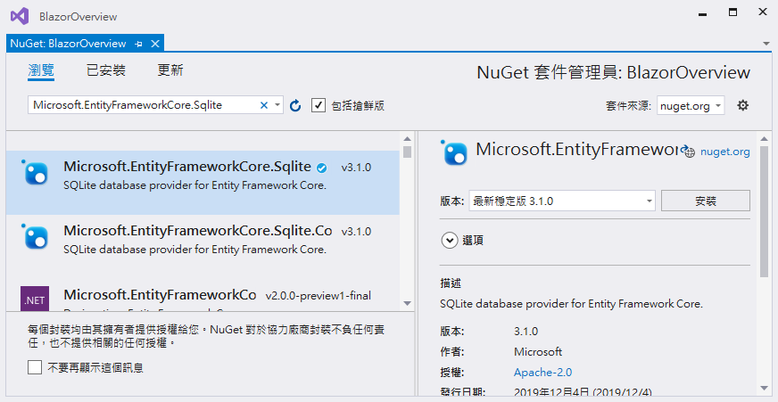
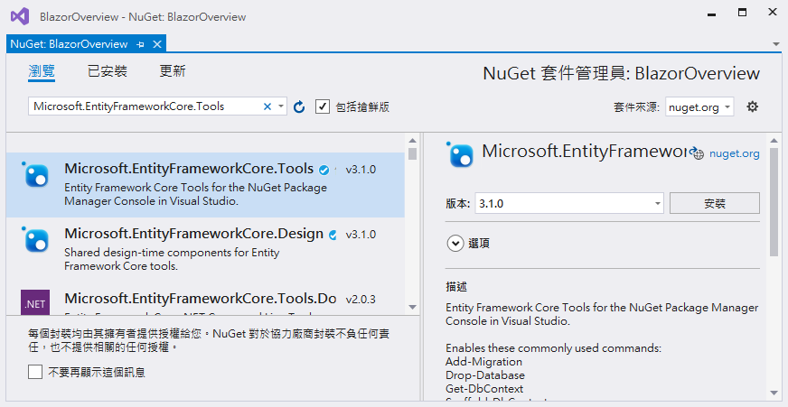
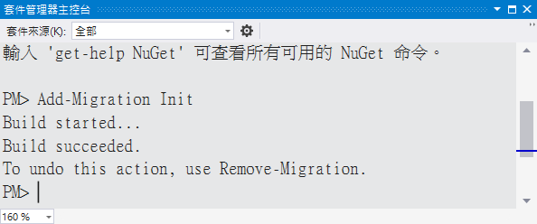
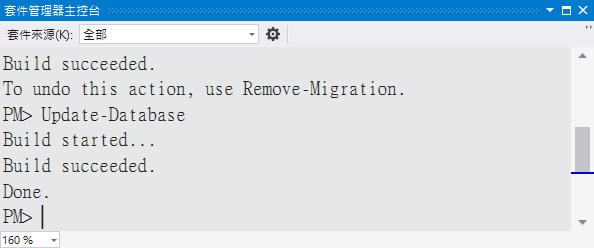
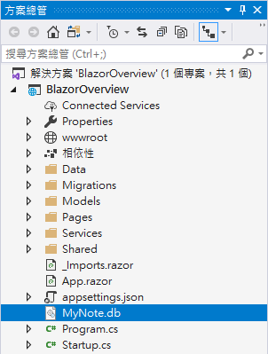
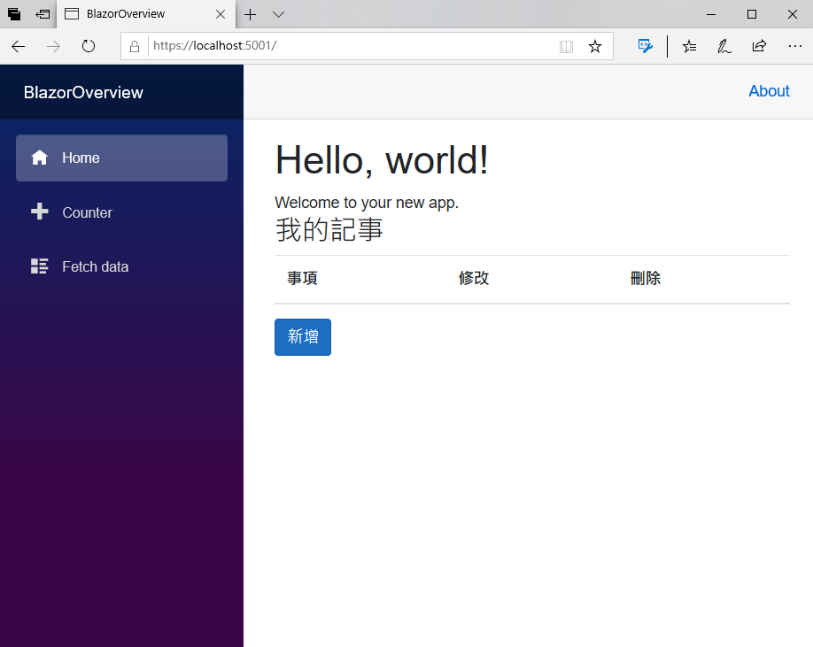
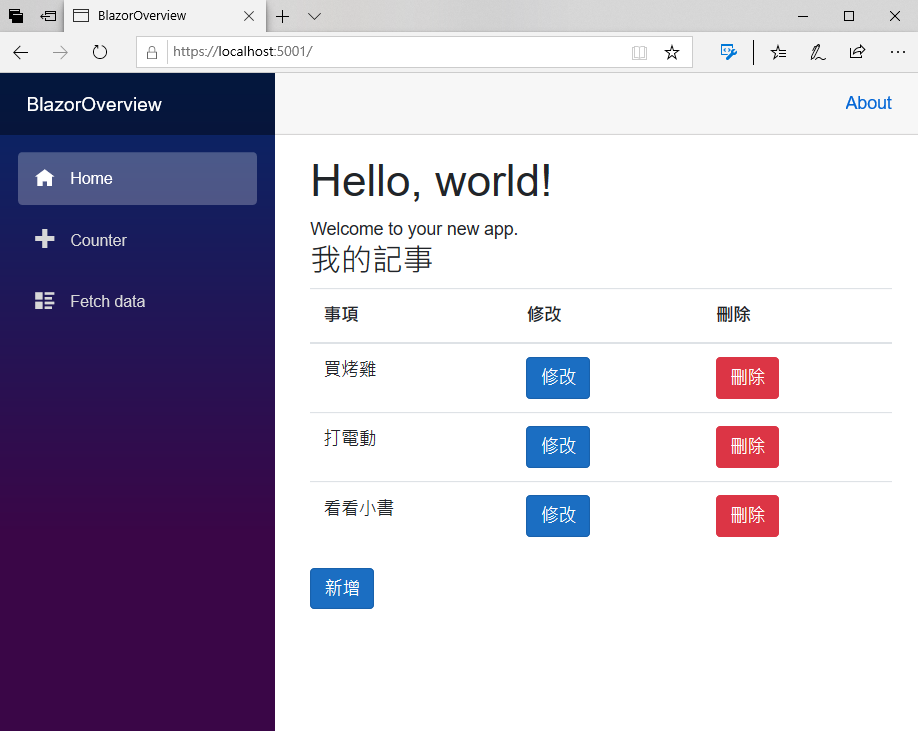

# 使用資料庫來儲存記事服務相關紀錄

現在，開始來改寫這個 Blazor 專案，將相關記事紀錄使用資料庫的方式來進行儲存，這裡將會使用 Entity Framework Core 這套 ORM 工具，並且使用 SQLite 資料庫來進行儲存這些記事紀錄。

X> ## 練習專案原始碼
X>
X> 在這一章完成的練習專案原始碼，可以從 [Notes Service To Database](https://github.com/vulcanlee/Blazor-Quick-Overview/tree/master/Notes%20Service%20To%20Database) 取得

## 安裝 Entity Framework Core 需要用到的套件

- 滑鼠右擊專案節點
- 在彈出功能表點選 [管理 NuGet 套件]
- 將會出現 [NuGet: BlazorOverview] 視窗
- 切換到 [瀏覽] 標籤內
- 在搜尋文字輸入盒內，輸入 `Microsoft.EntityFrameworkCore.Sqlite` 文字
- 點選這個 [Microsoft.EntityFrameworkCore.Sqlite] 套件，並且安裝到這個專案內
  
  

- 在搜尋文字輸入盒內，輸入 `Microsoft.EntityFrameworkCore.Tools` 文字
- 點選這個 [Microsoft.EntityFrameworkCore.Tools] 套件，並且安裝到這個專案內
  
  

## 建立使用資料庫用到 DbContext 類別

- 滑鼠右擊 [Models] 資料夾節點
- 在彈出功能表點選 [加入] > [類別]
- 出現 [新增項目 - BlazorOverview] 對話窗
- 請在 [名稱] 欄位，輸入 `MyNoteDbContext.cs`
- 最後，請點選 [新增] 按鈕
- 在這個類別最前面，加入底下的使用命名空間宣告

```csharp
using Microsoft.EntityFrameworkCore;
```

- 使用底下程式碼來替換到這個檔案內的所有內容

```csharp
using Microsoft.EntityFrameworkCore;

namespace BlazorOverview.Models
{
    public class MyNoteDbContext : DbContext
    {
        public MyNoteDbContext(DbContextOptions<MyNoteDbContext> options)
            : base(options)
        {
        }
        public DbSet<MyNote> MyNotes { get; set; }
    }
}
```

## 修正記事資料模型類別

- 在專案中找到 [Models] 資料夾節點
- 開啟 [MyNote.cs] 檔案節點
- 加入 `public int Id { get; set; }` 這個屬性宣告，作為這個資料表的主鍵值 Key 欄位
- 完成後的程式碼如下

```csharp
public class MyNote :ICloneable
{
    public int Id { get; set; }
    // 要加上這個屬性宣告，讓表單資料驗證可以檢查 Title 不可為空白
    [Required(ErrorMessage = "事項標題不可為空白")]
    public string Title { get; set; }
    // 使用淺層複製的方式，產生出相同屬性值的物件
    public MyNote Clone()
    {
        return ((ICloneable)this).Clone() as MyNote;
    }
    // 這裡為使用明確方式來實作 ICloneable 介面
    object ICloneable.Clone()
    {
       return this.MemberwiseClone();
    }
}
```

## 註冊使用 SQLite 資料庫服務

- 在專案根目錄下，找到 [Startup.cs] 檔案節點
- 打開這個檔案
- 在這個 Startup 類別最前面，加入底下的使用命名空間宣告

```csharp
using BlazorOverview.Models;
using Microsoft.EntityFrameworkCore;
```
- 找到 [ConfigureServices] 方法
- 在該方法的後面，加入底下的程式碼

```csharp
// 宣告使用 SQLite 資料庫
services.AddDbContext<MyNoteDbContext>(options =>
{
    options.UseSqlite("Data Source=MyNote.db");
});
```

## 建立使用資料庫的記事服務具體實作類別

- 滑鼠右擊 [Services] 資料夾節點
- 在彈出功能表點選 [加入] > [類別]
- 出現 [新增項目 - BlazorOverview] 對話窗
- 請在 [名稱] 欄位，輸入 `MyNoteDbService.cs`
- 最後，請點選 [新增] 按鈕
- 在這個類別最前面，加入底下的使用命名空間宣告

```csharp
using BlazorOverview.Models;
using Microsoft.EntityFrameworkCore;
```
- 在這個類別，使用底下的程式碼來設計

```csharp
using BlazorOverview.Models;
using Microsoft.EntityFrameworkCore;
using System;
using System.Collections.Generic;
using System.Linq;
using System.Threading.Tasks;

namespace BlazorOverview.Services
{
    public class MyNoteDbService : IMyNoteService
    {
        public MyNoteDbContext MyNoteDbContext { get; }

        // 使用建構式注入方式，注入 MyNoteDbContext 類別執行個體，以便可以存取 SQLite 資料庫
        public MyNoteDbService(MyNoteDbContext myNoteDbContext)
        {
            MyNoteDbContext = myNoteDbContext;
        }
        // 建立一筆新記事紀錄
        public async Task CreateAsync(MyNote myNote)
        {
            await MyNoteDbContext.MyNotes.AddAsync(myNote);
            await MyNoteDbContext.SaveChangesAsync();
        }
        // 查詢所有記事紀錄
        public async Task<List<MyNote>> RetriveAsync()
        {
            return await MyNoteDbContext.MyNotes.ToListAsync();
        }
        // 修改記事紀錄
        public async Task UpdateAsync(MyNote origMyNote, MyNote myNote)
        {
            var fooItem = await MyNoteDbContext.MyNotes.FirstOrDefaultAsync(x => x.Id == origMyNote.Id);
            if (fooItem != null)
            {
                fooItem.Title = myNote.Title;
                await MyNoteDbContext.SaveChangesAsync();
            }
        }
        // 刪除記事紀錄
        public async Task DeleteAsync(MyNote myNote)
        {
            MyNoteDbContext.MyNotes.Remove(await MyNoteDbContext.MyNotes.FirstOrDefaultAsync(x => x.Id == myNote.Id));
            await MyNoteDbContext.SaveChangesAsync();
        }
    }
}
```

## 註冊使用資料庫的記事服務具體實作類別

- 在專案根目錄下，找到 [Startup.cs] 檔案節點
- 打開這個檔案
- 找到 [ConfigureServices] 方法
- 請將 `services.AddScoped<IMyNoteService, MyNoteService>();` 敘述註解起來，不再使用，因為現在要使用資料庫來存取記事資料
- 在 `services.AddScoped<IMyNoteService, MyNoteService>();` 之後，加入 `services.AddScoped<IMyNoteService, MyNoteDbService>();` 敘述

## 設計完成後的完整 Startup.cs 內容

- 確認這個 Startup.cs 檔案內容，與底下的程式碼相同

```csharp
using System;
using System.Collections.Generic;
using System.Linq;
using System.Threading.Tasks;
using Microsoft.AspNetCore.Builder;
using Microsoft.AspNetCore.Components;
using Microsoft.AspNetCore.Hosting;
using Microsoft.AspNetCore.HttpsPolicy;
using Microsoft.Extensions.Configuration;
using Microsoft.Extensions.DependencyInjection;
using Microsoft.Extensions.Hosting;
using BlazorOverview.Data;
using BlazorOverview.Services;
using BlazorOverview.Models;
using Microsoft.EntityFrameworkCore;

namespace BlazorOverview
{
    public class Startup
    {
        public Startup(IConfiguration configuration)
        {
            Configuration = configuration;
        }

        public IConfiguration Configuration { get; }

        // This method gets called by the runtime. Use this method to add services to the container.
        // For more information on how to configure your application, visit https://go.microsoft.com/fwlink/?LinkID=398940
        public void ConfigureServices(IServiceCollection services)
        {
            services.AddRazorPages();
            services.AddServerSideBlazor();
            services.AddSingleton<WeatherForecastService>();

            // 進行 DI 容器註冊
            //services.AddScoped<IMyNoteService, MyNoteService>();
            services.AddScoped<IMyNoteService, MyNoteDbService>();

            // 宣告使用 SQLite 資料庫
            services.AddDbContext<MyNoteDbContext>(options =>
            {
                options.UseSqlite("Data Source=MyNote.db");
            });
        }

        // This method gets called by the runtime. Use this method to configure the HTTP request pipeline.
        public void Configure(IApplicationBuilder app, IWebHostEnvironment env)
        {
            if (env.IsDevelopment())
            {
                app.UseDeveloperExceptionPage();
            }
            else
            {
                app.UseExceptionHandler("/Error");
                // The default HSTS value is 30 days. You may want to change this for production scenarios, see https://aka.ms/aspnetcore-hsts.
                app.UseHsts();
            }

            app.UseHttpsRedirection();
            app.UseStaticFiles();

            app.UseRouting();

            app.UseEndpoints(endpoints =>
            {
                endpoints.MapBlazorHub();
                endpoints.MapFallbackToPage("/_Host");
            });
        }
    }
}
```

## 啟用 EF Core 中的移轉功能

- 點選 Visual Studio 2019 功能表 [工具] > [套件管理員] > [套件管理器主控台]
- 現在在 Visual Studio 2019 內， [套件管理器主控台] 視窗將會顯示出來
- 在 [套件管理器主控台] 視窗內，輸入 `Add-Migration Init`
  
  

- 在 [套件管理器主控台] 視窗內，輸入 `Update-Database`
  
  

- 請觀察方案總管內，將會看到 SQLite 資料庫 (MyNote.db) 已經產生出來了
  
  

## 執行這個專案

- 現在要來確認剛剛設計的 MyNoteService 是否可以正常運作
- 請點選工具列上方的綠色三角形，或者按下 F5 ，開始執行這個 Blazor 專案
- 此時，將會在瀏覽器上出現底下畫面
  
  

- 因為現在使用的是 MyNoteDbService 服務，而現在的資料庫內並沒有任何資料，所以從網頁畫面看不到任何紀錄
- 請任意新增一些記事紀錄之後，就會呈現如下面螢幕截圖畫面
  
  

- 現在，可以停止執行這個專案，並且關閉掉現在的瀏覽器
- 重新執行這個專案
- 將會看到剛剛輸入的資料都還存在，因為，這些記事紀錄都是從資料庫取得的 
  
  

## 結論

相信大家已經體會到使用相依性注入技術的好處，在這裡可以重新設計一個新的服務，只需要重新註冊這個新的服務，原先的程式碼都無需做任何修改，就可以切換成為使用資料庫作為儲存的對象。
