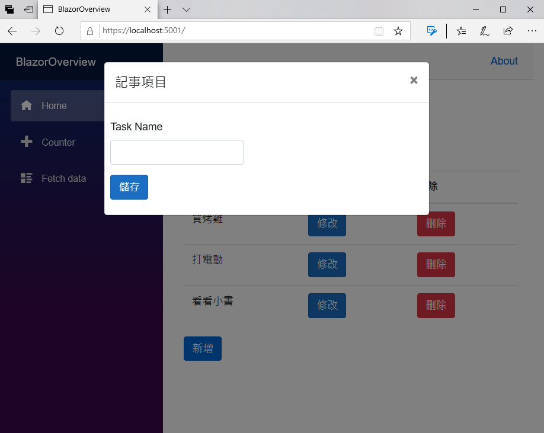
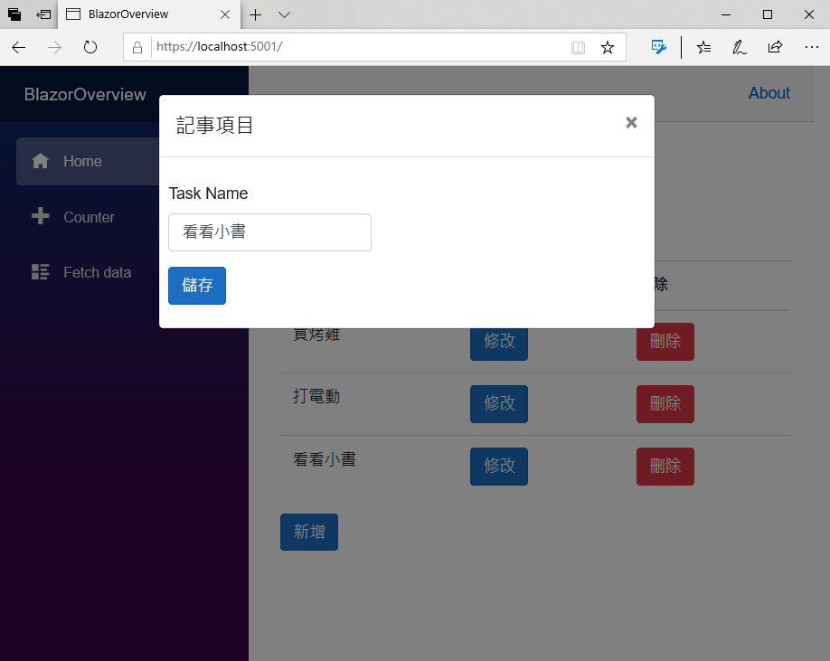
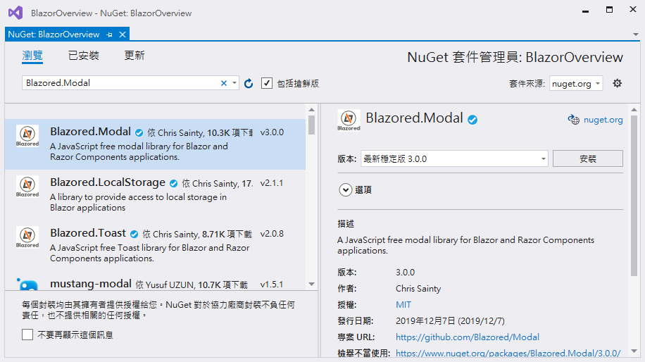
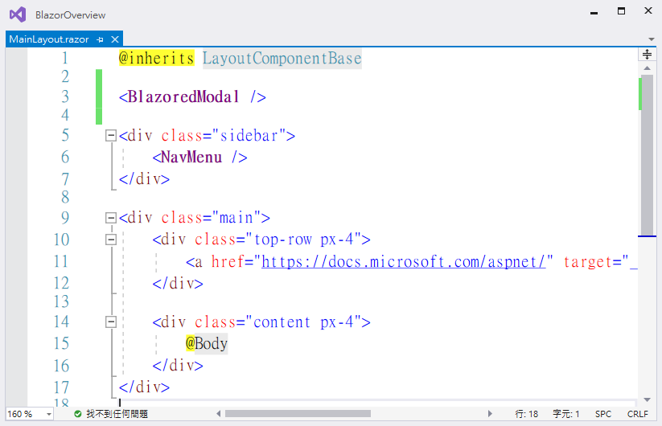
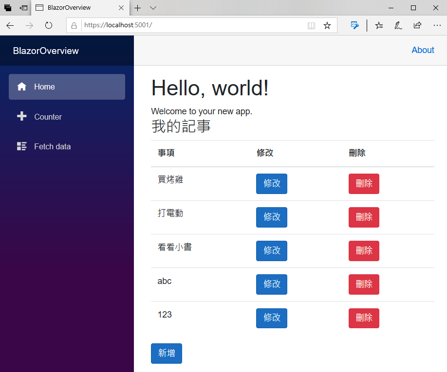
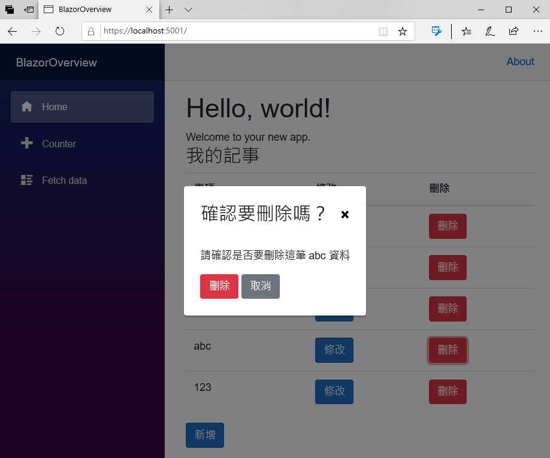
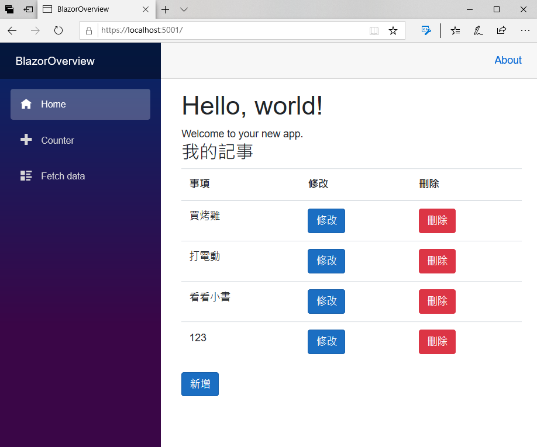

# 在 Blazor 專案內呼叫 JavaScript 程式碼

對於之前開發的 Blazor 專案中，用於新增與修改的 BootStrap 對話窗功能，是使用資料綁定的方式來顯示與關閉的，在這次的練習，將會讓 Blazor 專案，使用 C# 來呼叫 jQuery 的程式碼，做到動態的關閉與顯示對話窗的效果，另外，將會體驗使用 Blazor 的開源套件，針對刪除功能，一樣不會透過 JavaScript 的程式碼，可以動態的詢問是否要刪除這筆記事紀錄，依據使用者在對話窗內的選擇，決定是否要刪除這筆記事。

## 加入 BootStrap 需要用到的 JavaScript

- 在專案中找到 [Pages] 資料夾節點
- 開啟 [_Host.cshtml] 檔案節點
- 在該檔案的 `<script src="_framework/blazor.server.js"></script>` 程式碼前，加入底下的敘述

```html
<script src="https://code.jquery.com/jquery-3.4.1.slim.min.js" integrity="sha384-J6qa4849blE2+poT4WnyKhv5vZF5SrPo0iEjwBvKU7imGFAV0wwj1yYfoRSJoZ+n" crossorigin="anonymous"></script>
<script src="https://cdn.jsdelivr.net/npm/popper.js@1.16.0/dist/umd/popper.min.js" integrity="sha384-Q6E9RHvbIyZFJoft+2mJbHaEWldlvI9IOYy5n3zV9zzTtmI3UksdQRVvoxMfooAo" crossorigin="anonymous"></script>
<script src="https://stackpath.bootstrapcdn.com/bootstrap/4.4.1/js/bootstrap.min.js" integrity="sha384-wfSDF2E50Y2D1uUdj0O3uMBJnjuUD4Ih7YwaYd1iqfktj0Uod8GCExl3Og8ifwB6" crossorigin="anonymous"></script>
 
<script>
    function ShowModal(modalId) {
        $('#' + modalId).modal('show');
    }
    function CloseModal(modalId) {
        $('#' + modalId).modal('hide');
    }
</script>
```
## 修正 MyNotes.razor 元件，可以呼叫 JavaScript

- 在專案中找到 [Pages] 資料夾節點
- 開啟 [MyNotes.razor] 檔案節點
- 在該檔案最前面的 `@inject IMyNoteService MyNoteService` 程式碼前，加入底下的敘述

```csharp
@*注入這個物件，使得在 Blazor 元件內，可以使用 C# 呼叫 JavaScript*@
@inject IJSRuntime jsRuntime
```

- 找到 `@if (ShowPopup){...}` 這個程式碼區塊，將這些內容全部刪除
- 在同樣的位置，使用底下 HTML 標記來取代

```html
@*這裡的 BootStrap 對話窗，將會透過使用 C# 呼叫 jQuery 來顯示與關閉 *@
<div class="modal" tabindex="-1" role="dialog" id="@DialogIdName">
    <div class="modal-dialog" role="document">
        <div class="modal-content">
            <div class="modal-header">
                <h5 class="modal-title">記事項目</h5>
                <button type="button" class="close" @onclick="CloseDialog">
                    <span aria-hidden="true">×</span>
                </button>
            </div>
            <div class="modal-body">
                <div class="row">
                    <div class="col-9">
                        <div class="row p-2">
                            <EditForm Model="@CurrentMyNote" OnValidSubmit="@HandleValidSubmit">
                                <DataAnnotationsValidator />
                                <ValidationSummary />
                                <div class="form-group">
                                    <label for="taskName">Task Name</label>
                                    <InputText id="name" class="form-control" @bind-Value="@CurrentMyNote.Title" />
                                </div>
                                <button type="submit" class="btn btn-primary">儲存</button>
                            </EditForm>
                        </div>
                    </div>
                </div>
            </div>
        </div>
    </div>
</div>
```

- 在 `@code { }` 程式碼區塊內，加入底下的變數宣告

```csharp
// 要顯示該新增與修改對話窗的 Id 名稱
public string DialogIdName { get; set; } = "myModal";
```

- 將原先的 `ShowPopup = true;` 敘述，使用 `await jsRuntime.InvokeAsync<object>("ShowModal", DialogIdName);` 敘述來取代
  
  > 若呼叫 jsRuntime 的方法為同步方法，請在前面加上 `async` 修飾詞

- 將原先的 `ShowPopup = true;` 敘述，使用 `await jsRuntime.InvokeAsync<object>("ShowModal", DialogIdName);` 敘述來取代
  
  > 若呼叫 jsRuntime 的方法為同步方法，請在前面加上 `async` 修飾詞
  
## 執行這個專案

- 現在要來確認剛剛設計的 MyNoteService 是否可以正常運作
- 請點選工具列上方的綠色三角形，或者按下 F5 ，開始執行這個 Blazor 專案
- 瀏覽器顯示內容之後，請點選 [新增] 按鈕，將會出現底下畫面，這裡的對話窗將會是由 C# 呼叫 jQuery 程式碼而得到的結果
  
  
- 瀏覽器顯示內容之後，請點選任一記事 [修改] 按鈕，將會出現底下畫面，這裡的對話窗將會是由 C# 呼叫 jQuery 程式碼而得到的結果
  
  

## 安裝與設定 Blazored.Modal 元件

- 滑鼠右擊專案節點
- 在彈出功能表點選 [管理 NuGet 套件]
- 將會出現 [NuGet: BlazorOverview] 視窗
- 切換到 [瀏覽] 標籤內
- 在搜尋文字輸入盒內，輸入 `Blazored.Modal` 文字
- 點選這個 [Blazored.Modal] 套件，並且安裝到這個專案內
  
  

- 打開 [Startup.cs] 檔案節點，準備進行這個服務的註冊
- 在這個類別前面，使用底下程式碼，加上要使用命名空間的宣告

```csharp
using Blazored.Modal;
```

- 找到 [ConfigureServices] 這個方法，在其後面加上底下的敘述

```csharp
// 註冊 Blazored Modal 元件要用到的服務
services.AddBlazoredModal();
```

- 在專案的根目錄下，打開 [_Imports.razor] 檔案節點
- 在這個檔案的下方，加入底下命名空間宣告

```csharp
@using Blazored
@using Blazored.Modal
@using Blazored.Modal.Services
```

- 在 [Shared] 目錄下，打開 [MainLayout.razor] 檔案節點
- 在 `<div class="sidebar">` 標記前面，加入底下的標記宣告

```html
<BlazoredModal />
```



- 在 [Pages] 目錄下，打開 [MainLayout.razor] 檔案節點
- 在 `<head>...</head>` 標記區段間，加入底下的標記宣告

```html
<link href="_content/Blazored.Modal/blazored-modal.css" rel="stylesheet" />
```

## 新增刪除要使用的對話窗元件

- 滑鼠右擊 [Pages] 資料夾節點
- 在彈出功能表點選 [加入] > [新增項目]
- 出現 [新增項目 - BlazorOverview] 對話窗
- 請確認該對話窗左方的清單位於 [已安裝] > [Visual C#] > [ASP.NET Core] 節點上
- 在該對話窗的中間區域，點選 [Blazor 元件] 這個選項
- 請在 [名稱] 欄位，輸入 `ConfirmDelete.razor`
- 最後，請點選 [新增] 按鈕
- 使用底下標記與程式碼，替換掉這個檔案的內容

```html
@inject IModalService ModalService

<div class="simple-form">

    <div class="form-group">
        <p>請確認是否要刪除這筆 @RecordTitleName 資料</p>
    </div>

    <button @onclick="SubmitForm" class="btn btn-danger">刪除</button>
    <button @onclick="Cancel" class="btn btn-secondary">取消</button>
</div>

@code {
    [CascadingParameter] ModalParameters Parameters { get; set; }
    [CascadingParameter] BlazoredModal BlazoredModal { get; set; }

    // 這筆記事的名稱
    string RecordTitleName { get; set; }

    protected override void OnInitialized()
    {
        // 透過傳遞來的參數，取得當前記事的名稱
        RecordTitleName = Parameters.Get<string>("RecordTitleName");
    }

    void SubmitForm()
    {
        //使用者確定要刪除，回應 ModalResult.Ok
        ModalService.Close(ModalResult.Ok($"RecordTitleName {RecordTitleName} was submitted successfully."));
    }

    void Cancel()
    {
        //使用者取消刪除，回應 ModalResult.Close
        ModalService.Close(ModalResult.Cancel());
    }
}
```

## 使用 Blazored.Modal 元件來設計是否要刪除之對話窗功能

- 在 [Pages] 目錄下，打開 [MyNotes.razor] 檔案節點
- 在 `<h3>我的記事</h3>` 標記前面，加入底下的標記宣告

```html
@*注入 Blazored Modal 元件的實作物件*@
@inject IModalService Modal
```

- 找到 `private async void Delete(MyNote note)` 這個方法，把這個方法刪除掉
- 接著，在同樣的地方，加入底下的程式碼

```csharp
// 刪除按鈕的點選事件之處理委派方法
private void Delete(MyNote note)
{
    CurrentMyNote = note;
    var parameters = new ModalParameters();
    // 宣告要傳遞給刪除對話窗的參數
    parameters.Add("RecordTitleName", note.Title);
 
    // 綁定使用者關閉對話窗的觸發事件
    Modal.OnClose += ModalClosed;
    // 顯示這個刪除對話窗
    Modal.Show<ConfirmDelete>("確認要刪除嗎？", parameters);
}
// 刪除對話窗的事件被觸發所要執行的委派方法
async void ModalClosed(ModalResult modalResult)
{
    // 檢查使用者是否有點選確認按鈕
    if (modalResult.Cancelled)
    {
        Console.WriteLine("Modal was Cancelled");
    }
    else
    {
        // 若使用者點選了確定按鈕
        Console.WriteLine(modalResult.Data.ToString());
        await DeleteIt(CurrentMyNote);
        StateHasChanged();
    }
    //解除該對話窗所綁定的事件
    Modal.OnClose -= ModalClosed;
}
// 刪除這個筆記事紀錄
private async Task DeleteIt(MyNote note)
{
    // 透過 IMyNoteService.DeleteAsync() 方法，從集合清單中刪除所選擇的紀錄
    await MyNoteService.DeleteAsync(note);
    Notes = await MyNoteService.RetriveAsync();
}
```

## 執行這個專案

- 現在要來確認剛剛設計的 MyNoteService 是否可以正常運作
- 請點選工具列上方的綠色三角形，或者按下 F5 ，開始執行這個 Blazor 專案
- 此時，將會在瀏覽器上出現底下畫面
  
  

- 點選任一紀錄的 [刪除] 按鈕，將會呈現如下面螢幕截圖畫面
  
  

- 若在刪除對話窗中，點選 [刪除] 按鈕，這筆紀錄將會被刪除
  
  

## 結論

在進行 Blazor 專案開發的時候，還是可以繼續使用現行 JavaScript 豐富的 API，不過，對於許多原先 JavaScript 的API，若透過已經包裝好的 Blazor 元件類別庫，在進行設計上，將會方便了許多。
