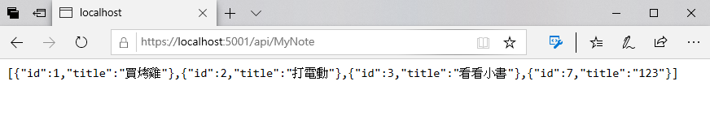
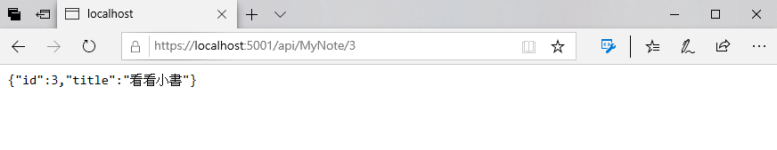

# 在 Blazor 專案加入 Web API 服務的功能

現在已經開發完成一個具有 CRUD 的 Blazor 專案，不過，若想要在這個 Blazor 專案內，提供具有 RESTful API 的功能，可以參考底下的說明。

## 修正記事資料模型

- 在 [Models] 目錄下，找到 [MyNote.cs] 檔案節點
- 打開這個檔案
- 在這個類別的最前面，加入底下的命名空間宣告

```csharp
using System.Text.Json.Serialization;
```

- 在這個 MyNote 類別內的兩個屬性上，分別加入 `JsonPropertyName` 屬性，如底下程式碼

```csharp
public class MyNote :ICloneable
{
    [JsonPropertyName("Id")]
    public int Id { get; set; }
    // 要加上這個屬性宣告，讓表單資料驗證可以檢查 Title 不可為空白
    [JsonPropertyName("Title")]
    [Required(ErrorMessage = "事項標題不可為空白")]
    public string Title { get; set; }
    // 使用淺層複製的方式，產生出相同屬性值的物件
    public MyNote Clone()
    {
        return ((ICloneable)this).Clone() as MyNote;
    }
    // 這裡為使用明確方式來實作 ICloneable 介面
    object ICloneable.Clone()
    {
       return this.MemberwiseClone();
    }
}
```

## 註冊 Web API 會用到的服務

- 在專案根目錄下，找到 [Startup.cs] 檔案節點
- 打開這個檔案
- 找到 [ConfigureServices] 方法
- 在該方法的後面，加入底下的程式碼

```csharp
// 新增控制器和 API 相關功能的支援，但不會加入 views 或 pages
services.AddControllers();
```

- 找到 [Configure] 方法
- 找到 `app.UseEndpoints` 這個 API 呼叫，依據底下程式碼，加入 `endpoints.MapControllers(); ` 程式碼

```csharp
app.UseEndpoints(endpoints =>
{
    // 新增屬性路由控制器的支援
    endpoints.MapControllers();
    endpoints.MapBlazorHub();
    endpoints.MapFallbackToPage("/_Host");
});
```

## 建立 Web API 要使用的控制器

- 滑鼠右擊專案節點
- 選擇 [加入] > [新增資料夾]
- 將這個資料夾命名為 [Controllers]
- 滑鼠右擊這個 [Controllers] 資料夾
- 在彈出功能表點選 [加入] > [類別]
- 出現 [新增項目 - BlazorOverview] 對話窗
- 請在 [名稱] 欄位，輸入 `MyNoteController.cs`
- 最後，請點選 [新增] 按鈕
- 開啟 [MyMyNoteController.cs] 檔案節點
- 在這個檔案的最前面，加入底下的命名空間宣告

```csharp
using Microsoft.AspNetCore.Mvc;
using BlazorOverview.Models;
```

- 使用底下程式碼，設計出這個 Web API 的 MyNoteController 控制器

```csharp
namespace BlazorOverview.Controllers
{
    [Route("api/[controller]")]
    [ApiController]
    public class MyNoteController : ControllerBase
    {
        public MyNoteDbContext MyNoteDbContext { get; }

        public MyNoteController(MyNoteDbContext myNoteDbContext)
        {
            MyNoteDbContext = myNoteDbContext;
        }

        [HttpGet]
        public IEnumerable<MyNote> Get()
        {
            return MyNoteDbContext.MyNotes.ToList();
        }
        
        [HttpGet("{id}", Name = "Get")]
        public MyNote Get(int id)
        {
            return MyNoteDbContext.MyNotes.FirstOrDefault(x=>x.Id == id);
        }

        [HttpPost]
        public void Post([FromBody] MyNote myNote)
        {
            MyNoteDbContext.MyNotes.Add(myNote);
            MyNoteDbContext.SaveChanges();
        }

        [HttpPut("{id}")]
        public void Put(int id, [FromBody] MyNote myNote)
        {
            MyNote NoteItem = MyNoteDbContext.MyNotes.FirstOrDefault(x => x.Id == id);
            NoteItem.Title = myNote.Title;
            MyNoteDbContext.SaveChanges();
        }

        [HttpDelete("{id}")]
        public void Delete(int id)
        {
            MyNoteDbContext.MyNotes.Remove(MyNoteDbContext.MyNotes.FirstOrDefault(x => x.Id == id));
            MyNoteDbContext.SaveChanges();
        }
    }
}
```

## 執行這個專案

- 現在要來確認剛剛設計的 MyNoteService 是否可以正常運作
- 請點選工具列上方的綠色三角形，或者按下 F5 ，開始執行這個 Blazor 專案
- 執行成功之後，請在瀏覽器上輸入網址 `https://localhost:5001/api/MyNote`
- 這個時候，將會呼叫剛剛設計的 Web API，取回所有的記事紀錄，如下圖所示
  
  

- 接著在瀏覽器上輸入網址 `https://localhost:5001/api/MyNote/3`
- 這個時候，將會呼叫剛剛設計的 Web API，取回指定 ID 的記事紀錄，如下圖所示
  
  
  
## 結論

這裡在 Blazor 專案內完成了 RESTful Web API 的設計
