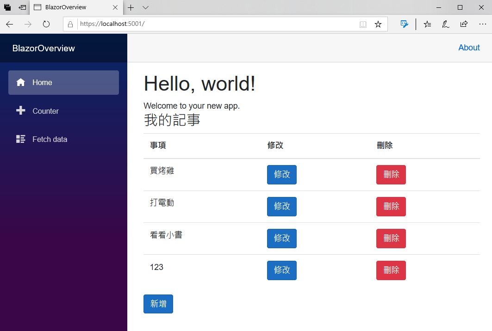

# 使用 Web API 來儲存記事服務相關紀錄

最後，將會來設計一個呼叫 Web API 的服務，讓 Blazor 專案可以來呼叫剛剛設計的 RESTful Web API 服務；當然，這裡又要再度借用 相依注入 Dependency Injection 這個設計模式，讓這個專案可以快速的替換使用 RESTful Web API 服務。

X> ## 練習專案原始碼
X>
X> 在這一章完成的練習專案原始碼，可以從 [Notes Web API With Service](https://github.com/vulcanlee/Blazor-Quick-Overview/tree/master/Notes%20Web%20API%20With%20Service) 取得

## 建立使用 Web API 的記事服務具體實作類別

- 滑鼠右擊 [Services] 資料夾節點
- 在彈出功能表點選 [加入] > [類別]
- 出現 [新增項目 - BlazorOverview] 對話窗
- 請在 [名稱] 欄位，輸入 `MyNoteWebAPIService.cs`
- 最後，請點選 [新增] 按鈕
- 在這個類別最前面，加入底下的使用命名空間宣告

```csharp
using System.Net.Http;
using BlazorOverview.Models;
using System.Text.Json;
using System.Text;
```
- 在這個類別，使用底下的程式碼來設計

```csharp
public class MyNoteWebAPIService : IMyNoteService
{
    public HttpClient Client { get; }
 
    // 使用建構式注入方式，注入 HttpClient 類別執行個體，以便可以呼叫 Web API
    public MyNoteWebAPIService(HttpClient httpClient)
    {
        Client = httpClient;
    }
    // 建立一筆新記事紀錄
    public async Task CreateAsync(MyNote myNote)
    {
        var content = JsonSerializer.Serialize(myNote);
        using (var stringContent = new StringContent(content, Encoding.UTF8, "application/json"))
        {
            await Client.PostAsync("/API/MyNote", stringContent);
        }
    }
    // 查詢所有記事紀錄
    public async Task<List<MyNote>> RetriveAsync()
    {
        var content = await Client.GetStringAsync("/API/MyNote");
        var allMyNotes = JsonSerializer.Deserialize<List<MyNote>>(content); ;
        return allMyNotes;
    }
    // 修改記事紀錄
    public async Task UpdateAsync(MyNote origMyNote, MyNote myNote)
    {
        var content = JsonSerializer.Serialize(myNote);
        using (var stringContent = new StringContent(content, Encoding.UTF8, "application/json"))
        {
            await Client.PutAsync($"/API/MyNote/{myNote.Id}", stringContent);
        }
    }
    // 刪除記事紀錄
    public async Task DeleteAsync(MyNote myNote)
    {
        await Client.DeleteAsync($"/API/MyNote/{myNote.Id}");
    } 
}
```

## 註冊 Web API 會用到的相關服務

- 在專案根目錄下，找到 [Startup.cs] 檔案節點
- 打開這個檔案
- 在這個 Startup 類別最前面，加入底下的使用命名空間宣告

```csharp
using System.Net.Http.Headers;
```
- 找到 [ConfigureServices] 方法
- 請將 `services.AddScoped<IMyNoteService, MyNoteDbService>();` 存取資料庫的服務註解起來
- 找到 `services.AddControllers();` 方法敘述，在該方法的後面，加入底下的程式碼

```csharp
//使用 IHttpClientFactory 來註冊 IMyNoteService 服務
services.AddHttpClient<IMyNoteService, MyNoteWebAPIService>(client =>
{
    client.BaseAddress = new Uri("https://localhost:5001/");
    client.DefaultRequestHeaders.Accept.Add(new MediaTypeWithQualityHeaderValue("application/json"));
});
```

## 設計完成後的完整 Startup.cs 內容

- 確認這個 Startup.cs 檔案內容，與底下的程式碼相同

```csharp
using System;
using System.Collections.Generic;
using System.Linq;
using System.Threading.Tasks;
using Microsoft.AspNetCore.Builder;
using Microsoft.AspNetCore.Components;
using Microsoft.AspNetCore.Hosting;
using Microsoft.AspNetCore.HttpsPolicy;
using Microsoft.Extensions.Configuration;
using Microsoft.Extensions.DependencyInjection;
using Microsoft.Extensions.Hosting;
using BlazorOverview.Data;
using BlazorOverview.Services;
using BlazorOverview.Models;
using Microsoft.EntityFrameworkCore;
using Blazored.Modal;
using System.Net.Http.Headers;

namespace BlazorOverview
{
    public class Startup
    {
        public Startup(IConfiguration configuration)
        {
            Configuration = configuration;
        }

        public IConfiguration Configuration { get; }

        // This method gets called by the runtime. Use this method to add services to the container.
        // For more information on how to configure your application, visit https://go.microsoft.com/fwlink/?LinkID=398940
        public void ConfigureServices(IServiceCollection services)
        {
            services.AddRazorPages();
            services.AddServerSideBlazor();
            services.AddSingleton<WeatherForecastService>();

            // 進行 DI 容器註冊
            //services.AddScoped<IMyNoteService, MyNoteService>();
            //services.AddScoped<IMyNoteService, MyNoteDbService>();

            // 宣告使用 SQLite 資料庫
            services.AddDbContext<MyNoteDbContext>(options =>
            {
                options.UseSqlite("Data Source=MyNote.db");
            });

            // 註冊 Blazored Modal 元件要用到的服務
            services.AddBlazoredModal();

            // 新增控制器和 API 相關功能的支援，但不會加入 views 或 pages
            services.AddControllers();

            //使用 IHttpClientFactory 來註冊 IMyNoteService 服務
            services.AddHttpClient<IMyNoteService, MyNoteWebAPIService>(client =>
            {
                client.BaseAddress = new Uri("https://localhost:5001/");
                client.DefaultRequestHeaders.Accept.Add(new MediaTypeWithQualityHeaderValue("application/json"));
            });
        }

        // This method gets called by the runtime. Use this method to configure the HTTP request pipeline.
        public void Configure(IApplicationBuilder app, IWebHostEnvironment env)
        {
            if (env.IsDevelopment())
            {
                app.UseDeveloperExceptionPage();
            }
            else
            {
                app.UseExceptionHandler("/Error");
                // The default HSTS value is 30 days. You may want to change this for production scenarios, see https://aka.ms/aspnetcore-hsts.
                app.UseHsts();
            }

            app.UseHttpsRedirection();
            app.UseStaticFiles();

            app.UseRouting();

            app.UseEndpoints(endpoints =>
            {
                // 新增屬性路由控制器的支援
                endpoints.MapControllers();
                endpoints.MapBlazorHub();
                endpoints.MapFallbackToPage("/_Host");
            });
        }
    }
}
```

## 執行這個專案

- 現在要來確認剛剛設計的 MyNoteService 是否可以正常運作
- 請點選工具列上方的綠色三角形，或者按下 F5 ，開始執行這個 Blazor 專案
- 此時，將會在瀏覽器上出現底下畫面
  
  

- 這個 Blazor 現在則是透過剛剛設計的 Web API 來存取記事服務，並且可以進行 CRUD 的相關操作。

## 結論

這次從資料庫存取服務切換成為使用 HttpClient 來呼叫 Web API 的設計過程，可謂相當的簡單就可以做到了，這一切都要歸功於 ASP.NET Core 的整體有效的架構與使用了相依性注入服務的關係。
